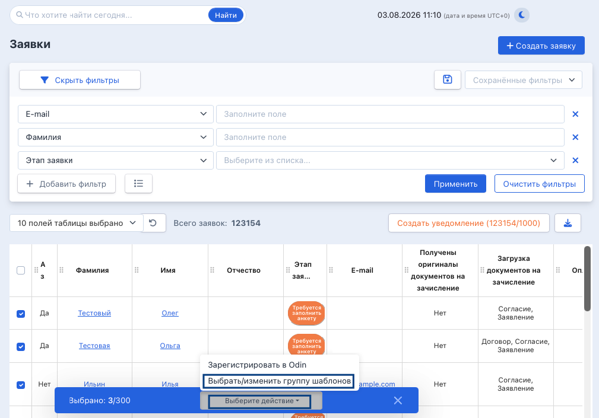
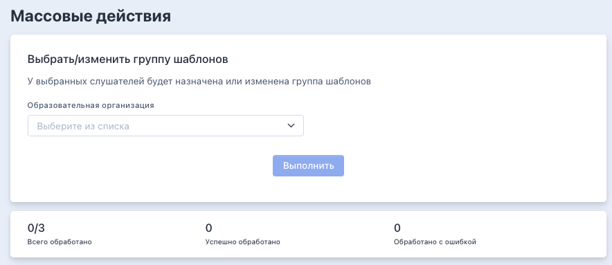
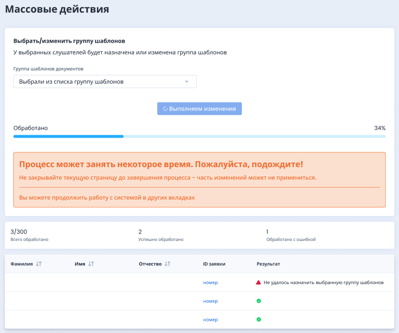

В системе доступно массовое действие: выбрать/изменить группу шаблонов. Как это работает:

На странице со списком заявок в выпадающем списке "Выберите действие» есть пункт "Выбрать/изменить группу шаблонов".

{width=1009px height=705px}

После выбора действия открывается страница выбранного массового действия с информацией, активной кнопкой «Выполнить» и счетчиком. В счетчике показывается, сколько заявок было выбрано для действия.

{width=884px height=383px}

После выбора группы шаблонов и нажатия кнопки «Выполнить» процесс запускается и показывается процент выполнения. Ниже появляется таблица с результатами массового действия по заявкам.

{width=815px height=680px}

Добавить/изменить шаблон можно только у заявок у которых не одобрены ДЗС. Поэтому при запуске этого массового действия проверяется наличие одобрения ДЗС каждой заявки. Если в списке есть заявки, у которых хоть один документ одобрен, в результате показывается ошибка "Нельзя изменить группу шаблонов: у заявки одобрен(ы) документы на зачисление".

Также при запуске этого массового действия проверяется, сгенерированы ли у заявки бланки документов. Если в списке заявок есть те, у которых сгенерированы бланки, то для таких показывается предупреждение: "Успешно. ВНИМАНИЕ: в заявке уже есть бланки документов. После смены группы шаблонов перегенерируйте документы".