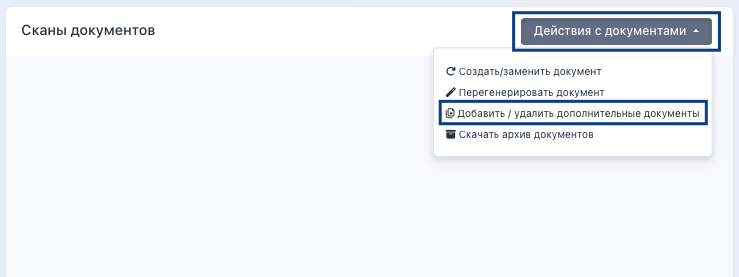
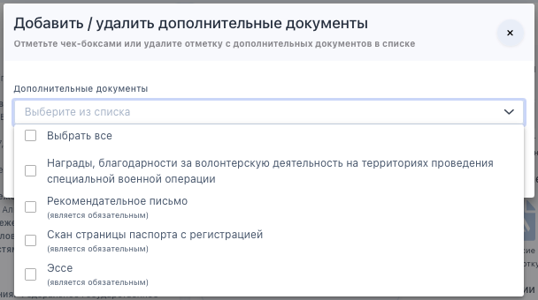
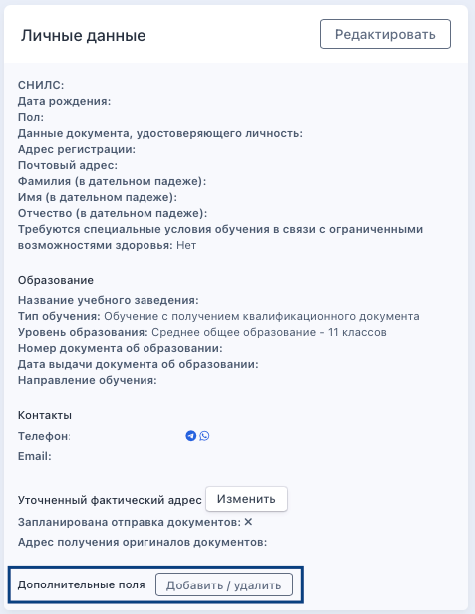
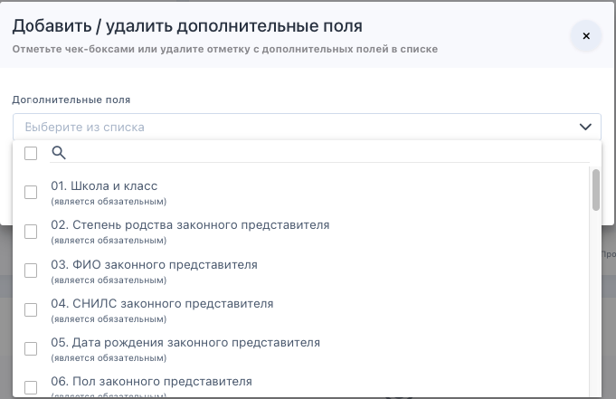

## Дополнительные документы и поля на странице организации

На странице организации можно добавить дополнительные:

1\.документы для вашей организации, которые необходимо загрузить слушателю в ЛК, а сотруднику организации проверить.

.png>)

Эти документы можно будет в дальнейшем удалять/редактировать.

.png>)

2\.поля для заполнения слушателем

.png>)

Далее выбрать добавленные документы и поля для ввода необходимо на странице [программы](./../../obuchenie/README/_index). Документы и поля будут доступны для заполнения в ЛК сдающего.

Каждому дополнительному полю можно задать свое уникальное ключевое слово, которое затем будет использоваться в шаблонах.

.png>)

3\.внешние источники

.png>)

## Дополнительные документы и поля на странице заявки

На странице заявки также можно добавить/удалить дополнительные документы и поля. Сделать это можно из соответствующих блоков. 

Дополнительные документы добавляются/удаляются из блока «Сканы документов» по клику на «Действия с документами» - «Добавить/удалить дополнительные документы».

{width=739px height=277px}

Далее в выпадающем списке выбрать, какие именно дополнительные документы необходимо добавить, а какие удалить. Если какие-то документы уже были выбраны  в заявке, то в списке они не отобразятся. Нельзя удалить дополнительные документы, по которым заявка уже сохранила на Шаге ЛК загруженные документы. Если в дополнительных документах обнаружилась ошибка/опечатка, организация может только отклонить ошибочные документы с комментарием, чтобы слушатель загрузил их заново.

{width=608px height=340px}

Из блока «Личные данные» можно добавить/удалить дополнительные поля.

{width=475px height=614px}

Откроется список с дополнительными полями, которые можно добавить/удалить. Если какие-то поля уже выбраны  в заявке, то в списке они не отобразятся. Нельзя удалить дополнительные поля, которые заявка уже сохранила на Шаге ЛК. Если в дополнительных полях обнаружилась ошибка/опечатка, у организации есть возможность отредактировать заполненные слушателем данные.

{width=681px height=441px}