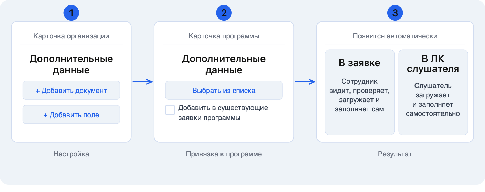

:::info 

В системе  через личный кабинет или создание заявки вручную собирается основной пакет данных и документов. [Подробнее](./../../slushateli/zayavki/nabor-dokumentov-sobiraemyy-v-sisteme)

**Дополнительно** к основному пакету  можно собрать/заполнить требуемые данные и документы, которые не входят в основной пакет. **Набор таких данных и документов каждая организация определяет самостоятельно**.

:::

{width=1410px height=560px}

### 

В системе Flow есть два типа дополнительных данных, которые организация может запросить у слушателя:

**Дополнительные документы** -- файлы, которые слушатель загружает в личном кабинете, а сотрудник организации проверяет. Например, медицинская справка или свидетельство о рождении ребёнка.

**Дополнительные поля** -- текстовые данные, которые слушатель заполняет в ЛК. Например, место работы или должность. Значения из полей можно использовать в [шаблонах документов](./../Shablony/_index) через ключевые слова.

---

### Как это работает

Чтобы дополнительные документы и поля появились в заявках, нужно пройти два шага настройки:

**Шаг 1 -- Карточка организации** Создайте документы и поля на вкладке «Дополнительные данные» в карточке организации. Здесь задаётся название, формат, обязательность и ключевое слово для шаблонов. Это делает сотрудник с правами администратора.

.png>)

.png>)

**Шаг 2 -- Карточка программы** Перейдите в карточку программы на вкладку «Дополнительные данные» и выберите из списка нужные документы и поля. [Подробнее](./../../obuchenie/Programma/dopolnitelnye-polya-i-faily).  После этого они автоматически появятся во всех **новых** заявках по этой программе.

-  **Если** требуется добавить документ или поле во **все** уже существующие заявки - отметьте галочку **«Добавить в существующие заявки программы»** при добавлении.

-  **Если** требуется добавить документ или поле в **одну или несколько** уже существующих заявок -  перейдите на страницу заявки и добавьте нужные поля/документы по кнопке «Действия с документами» в блоке «Сканы документов». [Подробнее](./../../chasto-zadavaemye-voprosy/kak-dobavit-pole-s-dop-dannymi-dop-dokument-vsem)

---

### Когда слушатель видит эти данные

Дополнительные документы и поля появляются у слушателя в ЛК после заполнения основной анкеты -- до загрузки документов на зачисление. Это соответствует этапу **«Дополнительные документы»** в воркфлоу заявки.

### Кто может заполнить данные

После того как документы и поля добавлены в программу, работать с ними могут обе стороны:

**Слушатель** -- самостоятельно загружает файлы и заполняет поля в своём личном кабинете.

**Сотрудник организации** -- видит загруженные документы и заполненные поля в карточке заявки, проверяет их, а также может загрузить документы и заполнить поля самостоятельно -- например, если слушатель передал данные в другом формате.