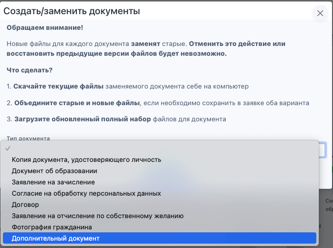

Для того, чтобы заменить дополнительный документ, надо:

Зайти на страницу заявки, в блоке со сканами документов выбрать кнопку «Действия с документами», далее нажать «Создать/заменить документ».

{width=383px height=236px}

Выбрать тип документа «Дополнительный документ».

{width=680px height=507px}

Перед заменой документа будет отображаться следующее предупреждение:

Обращаем внимание!

Новые файлы для каждого документа заменят старые. Отменить это действие или восстановить предыдущие версии файлов будет невозможно.

Что сделать?\
1\. Скачайте текущие файлы заменяемого документа себе на компьютер.\
2\. Объедините старые и новые файлы, если необходимо сохранить в заявке оба варианта.\
3\. Загрузите обновленный полный набор файлов для документа.

