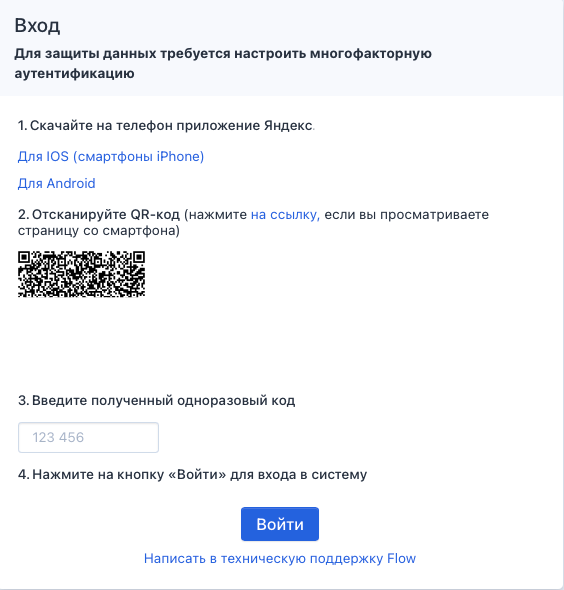
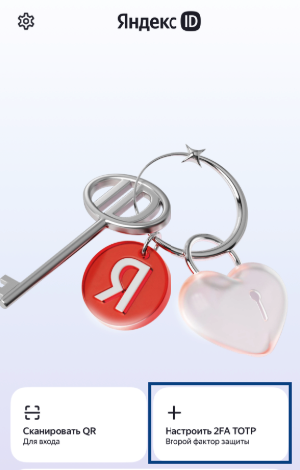
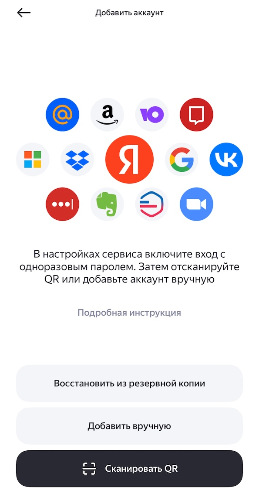

Для двойной защиты аккаунтов в системе установлена авторизация через Яндекс ID

1\.Скачайте приложение Яндекс ID на ваш смартфон, авторизируйтесь в приложении.

Ссылка для скачивания [RuStore](https://www.rustore.ru/catalog/app/ru.yandex.key)

Ссылка для скачивания [Google Play](https://play.google.com/store/apps/details?id=ru.yandex.key)

Ссылка для скачивания [App Store](https://apps.apple.com/ru/app/яндекс-ключ-ваши-пароли/id957324816)

2\.Перейдите на [страницу авторизации](https://2025.flow.tgu-dpo.ru/Account/Login1FA). Если авторизированы, то необходимо выйти.

3\.Введите логин и пароль от FLOW.

4\.Если учетная запись ещё не привязана к Яндекс ID, то отобразится QR код.

{width=564px height=590px}

5\.Откройте Яндекс ID на телефоне и нажмите знак «+», чтобы добавить новый аккаунт.

{width=300px height=470px}

6\.Нажмите "Сканировать QR" и наведите камеру на QR-код, отображенный в браузере.

{width=595px height=1140px}

7\.Для завершения настройки введите код, созданный Яндекс ID, в поле "Код подтверждения" во Flow.

### **Если QR-код не распознается**

Если приложение «Яндекс ID» не может считать QR-код со страницы, наиболее частая причина -- **слишком маленький масштаб страницы** в браузере. Из-за этого код становится недостаточно детализированным для камеры телефона.

**Что делать:**

1. **Увеличьте масштаб страницы в браузере.** Самый быстрый способ:

   -  Нажмите и удерживайте клавишу `Ctrl` на клавиатуре и **прокрутите колесо мыши от себя**.

   -  Страница увеличится, и QR-код станет больше.

2. **После успешного входа верните масштаб страницы в обычное состояние:**

   -  Зажмите `Ctrl` и прокрутите колесо мыши **на себя**.

   -  Или просто нажмите сочетание клавиш `Ctrl + 0` (ноль).

Также увеличение/уменьшение масштаба бывает доступно по сочетанию клавиш `Ctrl` ±.

**Примечание:**

-  Эта проблема чаще всего встречается на телефонах с **Android**. На устройствах iPhone она возникает значительно реже.

-  Иногда по умолчанию масштаб страницы бывает сильно уменьшен, поэтому всегда стоит проверить этот вариант в первую очередь.

После увеличения масштаба попробуйте отсканировать QR-код еще раз.