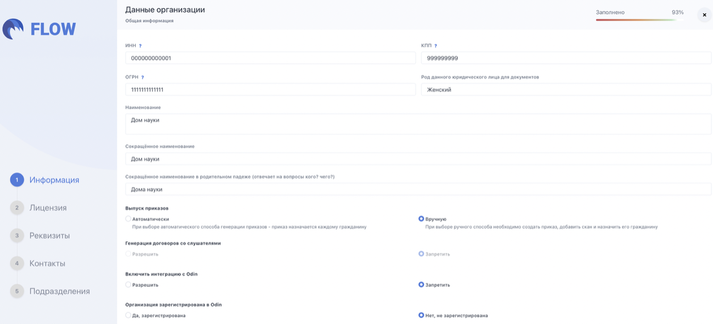
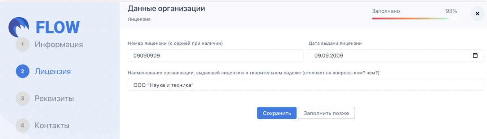
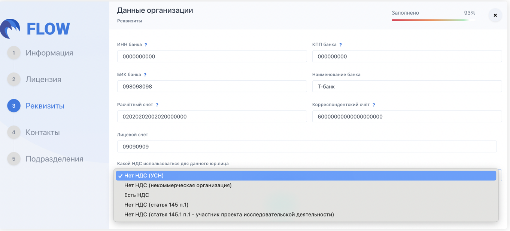
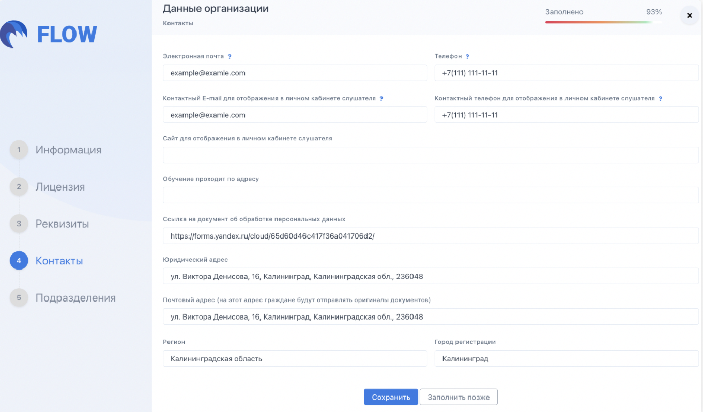

Организация - главная структурная единица во Flow. Все программы, потоки, заявки и документы привязаны к ней. Данные, которые вы укажете при создании, будут автоматически подставляться в шаблоны документов и отображаться в личных кабинетах (ЛК) слушателей - поэтому важно заполнить их точно.

## Регистрация

**Перейдите на страницу регистрации:** [**https://www.flow-crm.study/Registrations**](https://www.flow-crm.study/Registrations)

**Заполните данные о сотруднике, который будет администратором организации. После регистрации ему автоматически назначается роль Представитель организации (Администратор) -- с полным доступом к функционалу системы.**

.png>)

## **Заполните пять разделов:**

[tabs]

[tab:Информация]

Заполните данные организации

{width=1340px height=610px}

**Odin** -- информационная система, где может быть организован процесс обучения. Между Flow и Odin организована бесшовная интеграция: слушатели после оформления документов попадают в Odin, где обучаются. Информация об их обучении попадает во Flow. [Подробнее об Odin](https://www.odin.study/connect/)

[/tab]

[tab:Лицензия]

Заполните данные лицензии

{width=1350px height=386px}

[/tab]

[tab:Реквизиты]

Заполните реквизиты

{width=1362px height=618px}

[/tab]

[tab:Контакты]

Заполните контакты.

У каждого слушателя, кто будет [подавать заявку](./../slushateli/zayavki/_index) на программу вашей образовательной организации, будет [Личный кабинет](https://www.flow-crm.study/helpcrmstud). Информация из данного раздела будет доступна слушателям в этом личном кабинете, поэтому важно заполнить её и всегда поддерживать в актуальном состоянии.

{width=1360px height=798px}

[/tab]

[tab:Подразделение]

Подразделение -- структурная единица организации. Например, факультет в вузе.

В каждой организации внутри Flow должно быть хотя бы одно подразделение. Если внутренняя структура вашей организации не содержит подразделения, то вы можете создать номинальное, назвав его так же, как называется организация.

**Название** -- можно оставить стандартное значение «По умолчанию» или изменить на более подходящее.

[/tab]

[/tabs]

**Если каких-то данных пока нет -- нажмите «Заполнить позже» и вернитесь в любой момент.**

:::info 

Все данные об организации используются при генерации документов -- следите за их актуальностью.

:::

## **Что настроить сразу после создания**

-  [**Подписанты**](./podpisanty) **--** сотрудники, чьи данные подставляются в документы.

-  [**Шаблоны документов**](./Shablony/_index) **--** заявления, договоры, приказы.

-  [**Сотрудники и роли**](./../sotrudniki) **--** добавьте коллег и разграничьте доступ.

-  [**Программы**](./../obuchenie/Programma/_index) **и** [**потоки**](./../obuchenie/Potok/_index) **--** учебные программы с периодами обучения. 

:::info 

Если какие данные при заполнении неизвестны можно "Сохранить" и внести их позднее

:::

:::tip 

Перейдите в раздел [Быстрый старт](./../Start) для продолжения работы.

:::