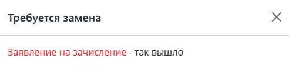

В случае, если ДЗС уже одобрены, а необходимо, чтобы слушатели загрузили дополнительный документ, организация [добавляет этот дополнительный документ](./kak-dobavit-pole-s-dop-dannymi-dop-dokument-vsem) в требования к загрузке, заявка откатится на шаг «Требуется заполнить анкету», загружает только этот документ.

Возможности заменить уже согласованные ранее ДЗС у слушателя не будет. Только если ДЗС не отклонены самой организацией.

Если же отклонен дополнительный документ, то заявка переводится на этап "Отклонена анкета" и на шаг в ЛК "**Заполнение дополнительных данных».** При переходе слушателя на шаг "**Заполнение дополнительных данных»,** он увидит отклоненные дополнительные документы и комментарии, оставленные представителем организации.

{width=492px height=130px}

Документы, требующие замены, будут подсвечены красным.