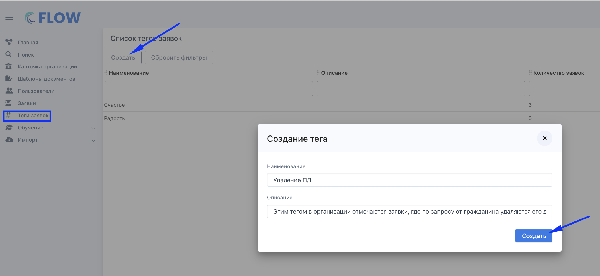
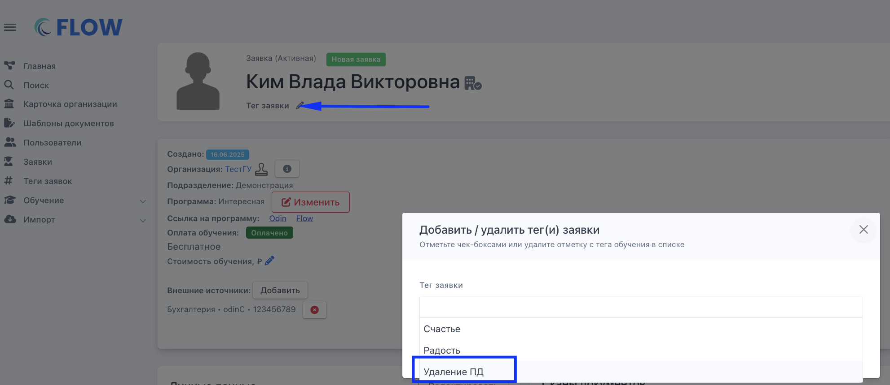
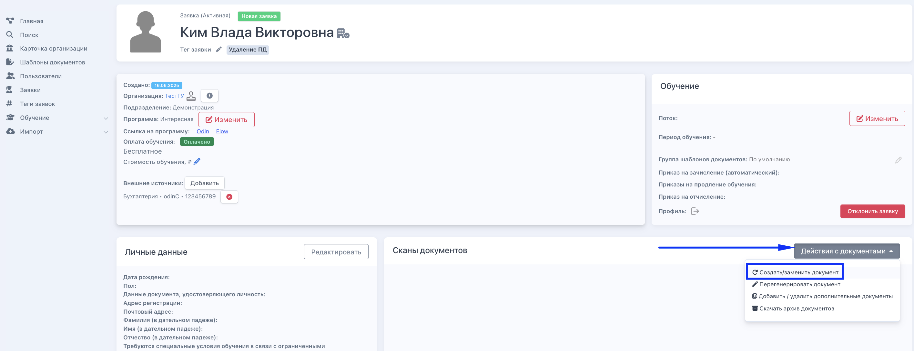
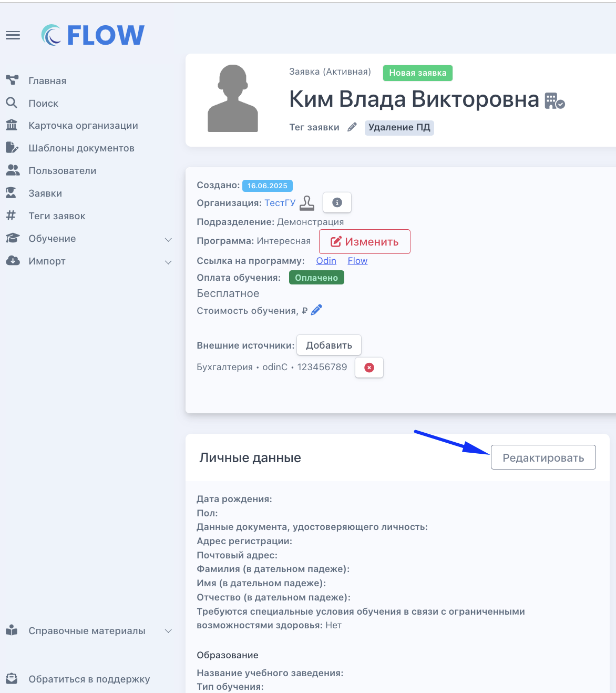
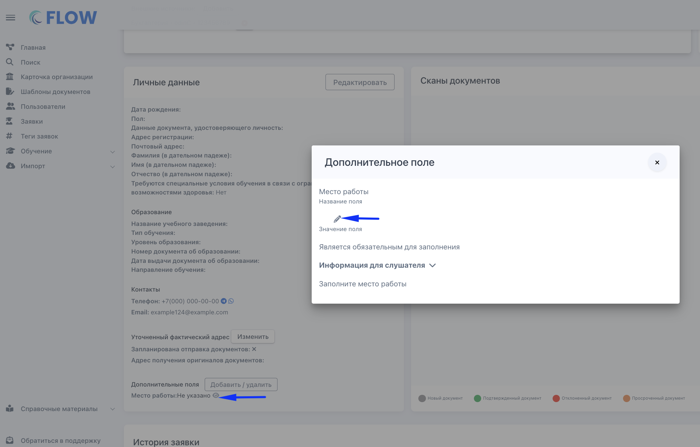

Если в образовательную организацию поступил запрос от гражданина с просьбой удалить его персональные данные, то:

**Шаг 0.** Создайте тег в организации, например, «ПД удалены по запросу»/ «Удаление ПД» или другой на ваше усмотрение. По этому тегу вы быстро сможете найти заявки, где были удалены персональные данные человека.

{width=2106px height=972px}

**Шаг 1.**  Откройте  страницу заявки и поставьте тег, созданный в шаге 0 (такой тег создаётся *один раз* и добавляется в любую из заявок)

{width=1982px height=860px}

**Шаг 2.**  Замените документы в заявке на пустые страницы. Вместо одного/всех документов загрузите акт об удалении ПД

{width=2832px height=1090px}

**Шаг 3.** Отредактируйте данные в заявке, которые требуется обезличить, заменив их на вымышленные.

При редактировании почты после собачки должно быть example.com (тогда эта почта точно будет несуществующей)

{width=1172px height=1318px}

**Шаг 4.** Проверьте дополнительные поля в заявке; при необходимости их тоже следует заменить на вымышленные.

{width=2028px height=1294px}

:::note 

**Важно!**

-  Если вы удалите все данные в заявке, восстановить их будет невозможно.

-  Если заявка относится к федеральному проекту, будьте особенно осторожны при удалении данных, так как не все из них можно удалить. Это должно быть прописано в согласии на обработку персональных данных, которое подписывал гражданин.

:::

:::info 

**Обратите внимание**, что при удалении данных описанным выше способом они удалятся только из Flow. Если вы используете эти данные в других системах (например, в AMO CRM или проводите обучение в Odin), ответственность за их удаление из этих систем несёт сотрудник организации.

:::