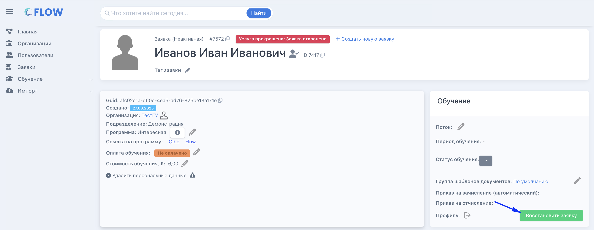

Неактивную заявку можно восстановить если нет приказа на отчисление.

{width=2906px height=1128px}

Возможности "Восстановить заявку» не будет на этапах "Отчислен: за неуспеваемость", "Отчислен на основании заявления слушателя", "Обучен - услуга оказана".

:::info 

**Как это применимо к восстановлению случайно отклоненной заявки:** если заявку отклонили, а затем в системе создали новую заявку с таким же набором данных, то ранее отклоненную заявку по кнопке восстановить будет нельзя, так как с таким набором данных уже существует активная заявка.

:::