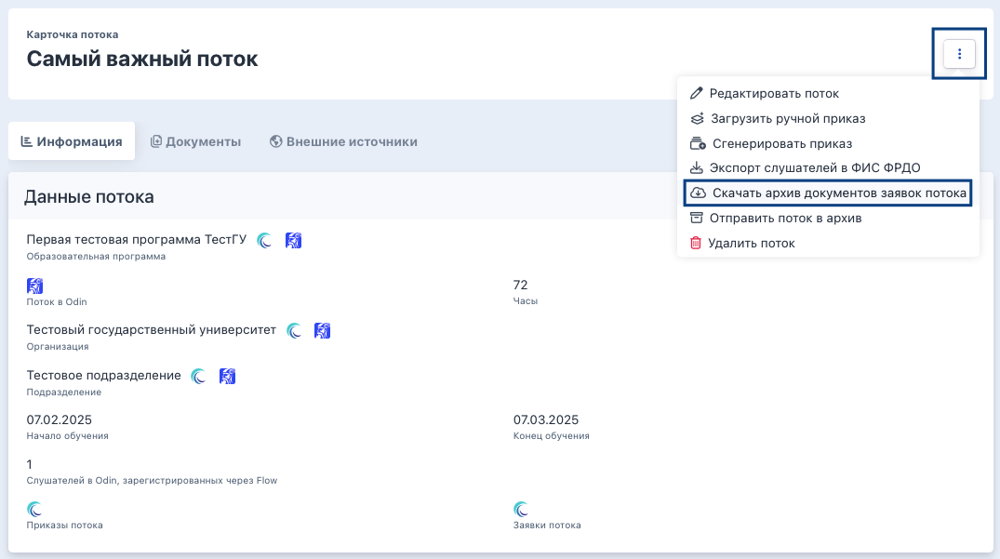

На странице потока есть возможность массово скачать архив документов, содержащий список архивов документов каждой из заявок.

Для скачивания архива в "троеточии" на странице потока надо найти кнопку "Скачать архив документов заявок потока". 

{width=1075px height=601px}

Архив будет называться как поток + дата скачивания.

Внутри  архива будут содержаться именные (ФИО) папки по каждому слушателю потока, а в папке каждого слушателя - файлы PDF по каждому из загруженных в заявке документов, в том числе и дополнительные документы.