:::info 

Во Flow доступно два способа оплаты обучения: онлайн через эквайринг (слушатель платит самостоятельно в ЛК) и ручная отметка менеджером (после получения оплаты любым удобным способом).

:::

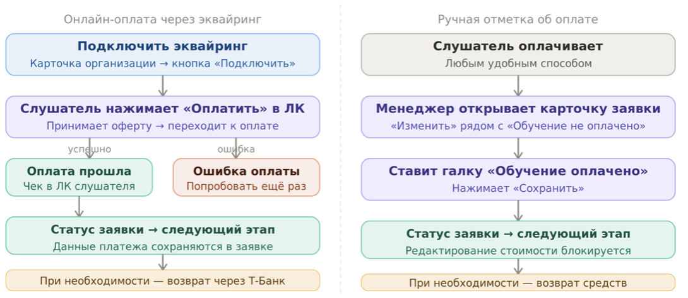{width=1090px height=474px}

## **Онлайн-оплата через эквайринг**

**Подключение эквайринга**

**На странице карточки организации нажмите кнопку «Подключить эквайринг» -- она откроет форму для заполнения данных в Т-Банке.**

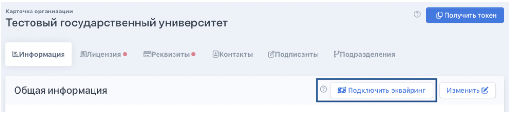{width=1050px height=254px}

**После сохранения данных придёт подтверждение -- эквайринг подключён.**

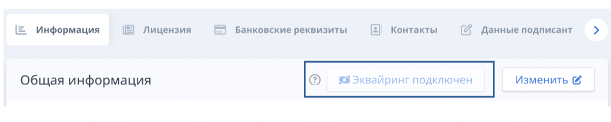{width=1054px height=212px}

### **Как оплачивает слушатель**

:::tip 

На шаге оплаты в личном кабинете слушатель нажимает кнопку «Оплатить». Откроется страница с информацией о сроках и стоимости обучения (стоимость подтягивается из программы), а также договором оферты. После того как слушатель отметит чек-бокс «Ознакомлен и согласен», станет доступна кнопка «Перейти к оплате».

:::

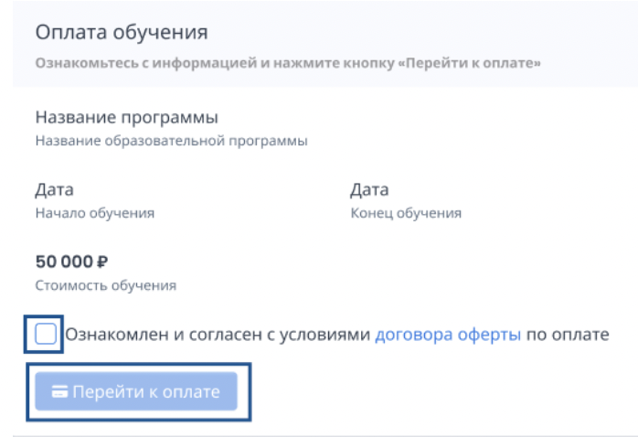{width=698px height=478px}

**При успешной оплате слушатель попадёт на страницу подтверждения и сможет перейти к следующему шагу.**

**Если оплата не прошла -- слушатель попадёт на страницу ошибки, откуда можно повторить попытку или обратиться в поддержку.**

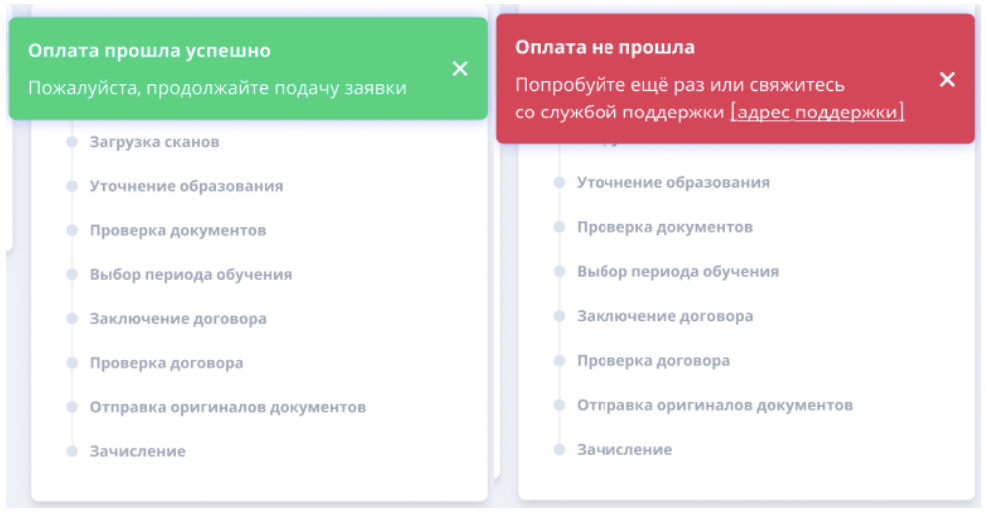{width=986px height=520px}

### **Чеки об оплате**

**После успешной оплаты в ЛК слушателя появляется чек. Слушатель может перейти по ссылке на чек в системе эквайринга.**

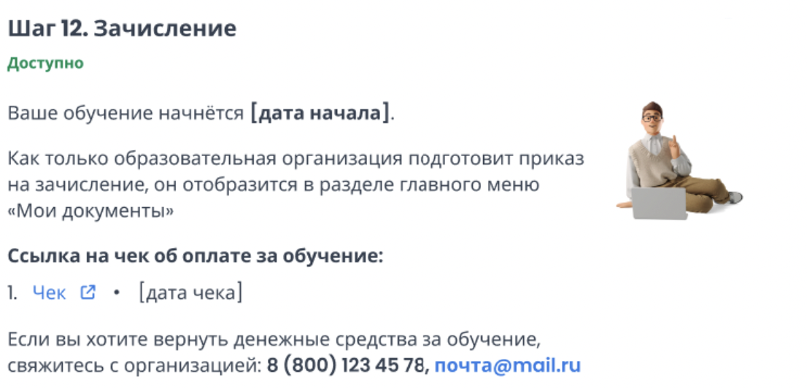{width=1106px height=532px}

**В карточке заявки данные о платеже фиксируются автоматически. Просмотреть их можно в модальном окне «Информация по оплате обучения» -- нажмите на иконку рядом со статусом оплаты.**

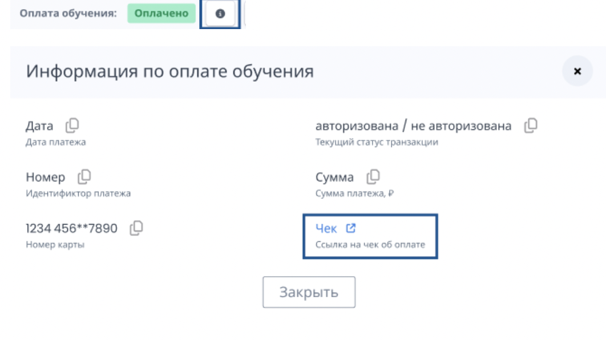{width=1062px height=596px}

***В окне хранятся: дата платежа, номер заказа, статус транзакции, идентификатор платежа, сумма, номер карты.***

### **Возврат оплаты**

**После успешной оплаты кнопка «Отклонить заявку» блокируется. Рядом со статусом оплаты появляется кнопка «Вернуть оплату за обучение» -- она ведёт на страницу оформления возврата в Т-Банке.**

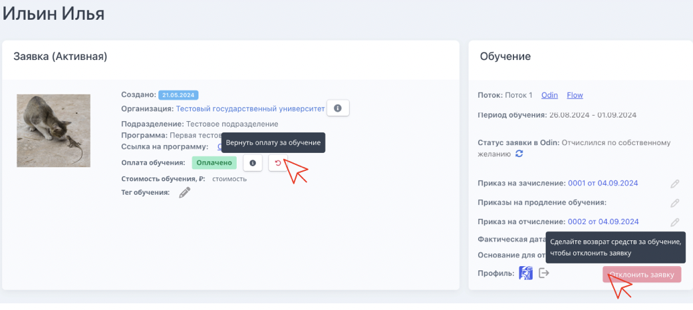{width=1042px height=466px}

**После проведения возврата статус оплаты меняется на «Произведён возврат средств», кнопка «Отклонить заявку» снова становится активной.**

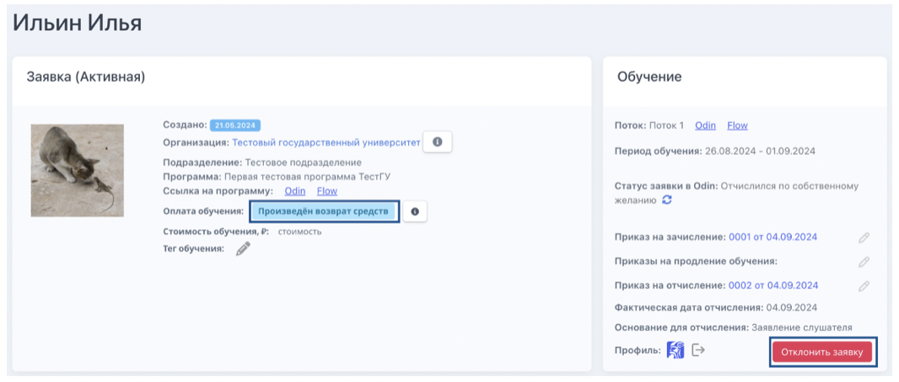{width=1066px height=454px}

**В модальном окне информации о платеже появится ссылка на чек о возврате.**

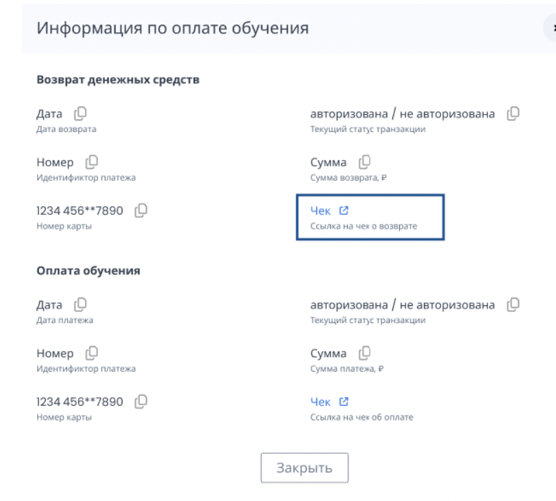{width=812px height=732px}

## **Как поставить отметку об оплате вручную**

:::info 

Если эквайринг не подключён или слушатель оплатил другим способом -- менеджер проставляет оплату вручную.

:::

**В карточке заявки нажмите «Изменить» рядом со строкой «Обучение не оплачено», поставьте галку «Обучение оплачено» и нажмите «Сохранить».**

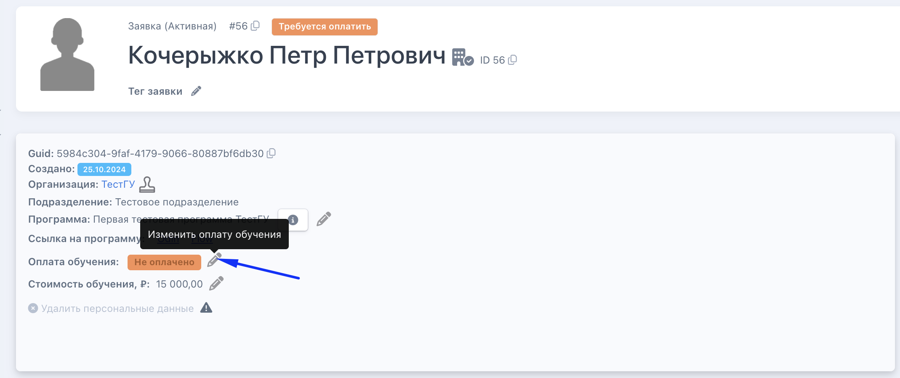{width=2138px height=898px}

**После сохранения заявка перейдёт на следующий этап, редактирование стоимости обучения и кнопка «Отклонить заявку» заблокируются.**

### **Возврат при ручной оплате**

**Если потребуется сделать возврат -- откройте модальное окно оплаты повторно. В нём появится кнопка «Возврат средств».**

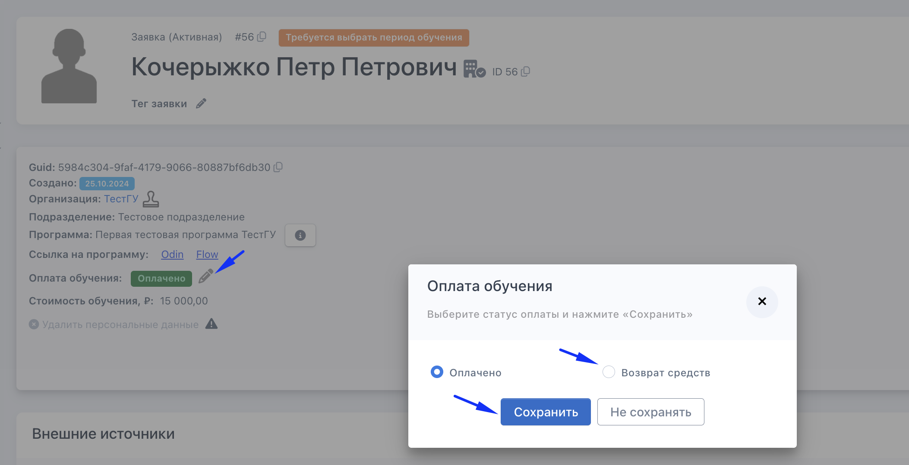{width=2106px height=1080px}