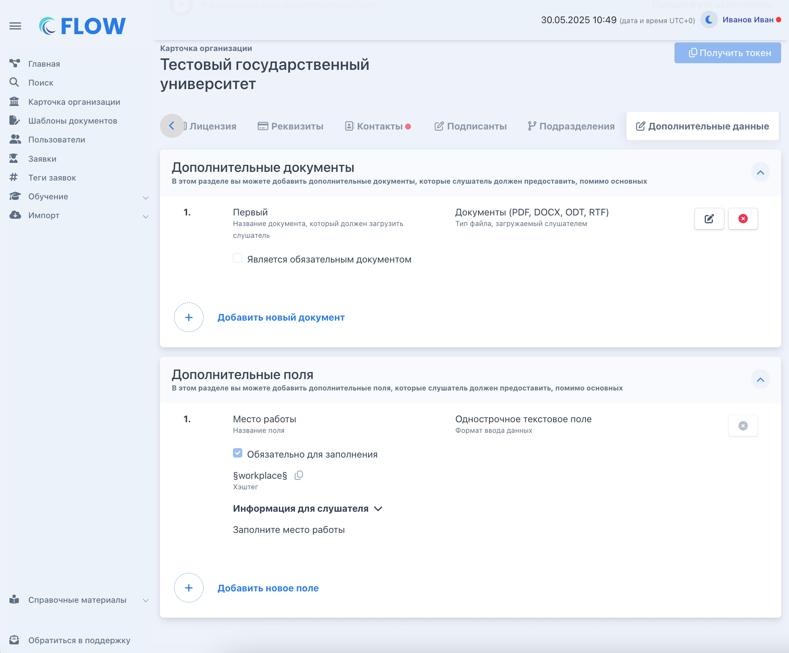
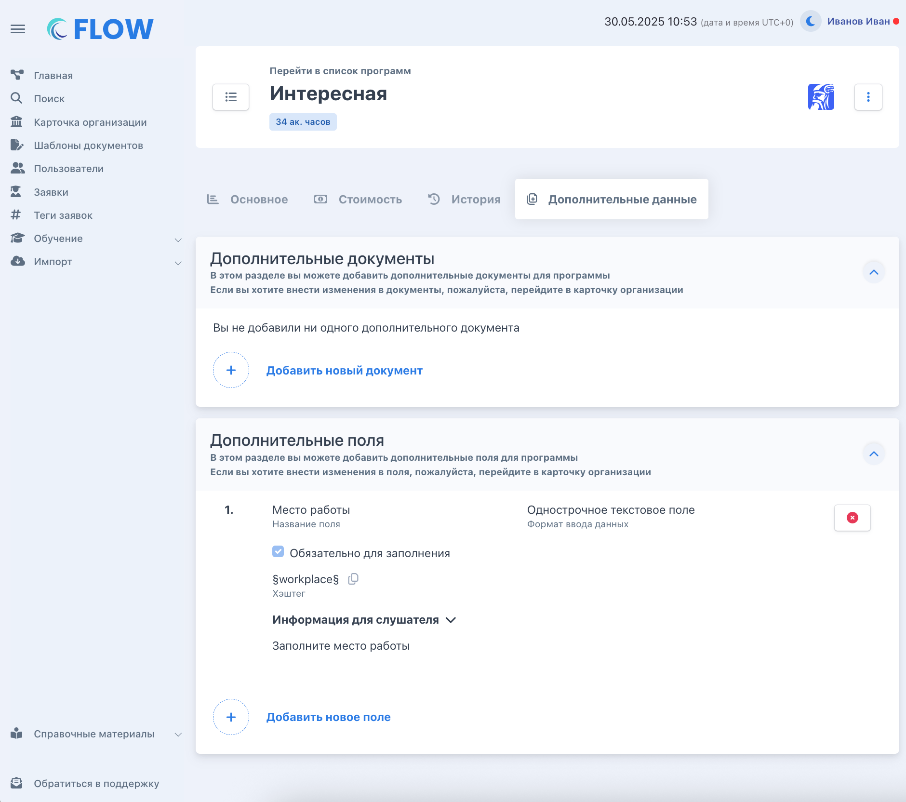
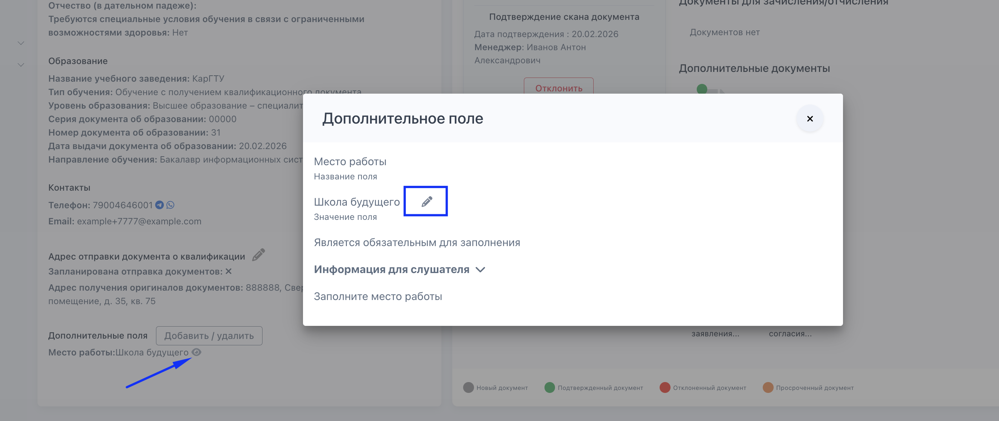

:::info 

**В системе Flow есть** [**стандартный набор данных**](./../../slushateli/zayavki/nabor-dokumentov-sobiraemyy-v-sisteme)**, который собирается с каждого слушателя. Но иногда организации нужно собрать что-то сверх этого -- например, место работы, должность или медицинскую справку. Для этого и существуют дополнительные поля и документы.**

**Есть два типа:**

-  **Дополнительные поля** (подробнее в этой статье) -- текстовые данные, которые слушатель заполняет в личном кабинете. Например: место работы, должность. Значения из полей можно подставлять в [шаблоны документов](./../../Organization/Shablony/_index) через ключевые слова.

-  Дополнительные документы -- файлы, которые слушатель загружает в ЛК, а менеджер проверяет. Например: медицинская справка, свидетельство о рождении ребёнка.

Набор таких данных каждая организация определяет самостоятельно.

:::

## **Шаг 1. Создайте поля  в карточке организации**

**Перейдите в карточку организации -> вкладка «Дополнительные данные» -> нажмите «Добавить».**

**Для каждого поля задайте:**

-  название -- понятное сотрудникам организации;

-  формат -- текст, число, дата и т.д.;

-  обязательность -- должен ли слушатель обязательно заполнить это поле.

Система автоматически присвоит ключевое слово -- его можно будет использовать в шаблонах документов.

{width=2012px height=1664px}

## **Шаг 2. Добавьте поля в программу**

**Перейдите в карточку программы -> вкладка «Дополнительные данные» -> выберите из списка нужные поля.**

**После этого они автоматически появятся во всех новых заявках по этой программе.**

{width=1880px height=1664px}

**Если нужно добавить в уже существующие заявки**

-  Все заявки сразу -- при добавлении отметьте галочку «Добавить в существующие заявки программы».

-  Одну или несколько заявок -- перейдите в заявку ->  блок «**Личные данные**» -> кнопка «Добавить/удалить»

## **Шаг 3. Используйте ключевое слово в шаблоне документа**

**На странице программы во вкладке «Дополнительные данные» рядом с каждым полем есть его тег -- ключевое слово для шаблонов.**

1. Скопируйте тег нужного поля.

2. Вставьте его в шаблон документа в нужное место.

3. Загрузите шаблон во Flow.

При генерации документа для слушателя вместо тега автоматически подставится реальное значение из заявки.

:::tip 

*Ключевые слова дополнительных полей работают так же, как ключевые слова внешних источников -- их можно скопировать прямо в интерфейсе, нажав на значок  «копировать» рядом с полем.*

:::

.png>)

## **Как отредактировать значение дополнительного поля**

Если слушатель заполнил поле с ошибкой или данные нужно уточнить, менеджер может исправить значение прямо в карточке заявки -- не дожидаясь, пока слушатель зайдёт в ЛК.

Как это сделать: в блоке «Дополнительные поля» нажмите на значок информации рядом с полем -- откроется модальное окно. В нём будет видно название поля, его текущее значение и подсказку для слушателя. Рядом со значением есть иконка карандаша -- нажмите её, чтобы отредактировать.

{width=2664px height=1124px}

Три сценария работы с полем

-  Поле заполнено с ошибкой -- сотрудник может исправить значение сам: перейдите в карточку заявки -> блок «Личные данные» -> нажмите на значение поля и отредактируйте его.

-  Нужно, чтобы слушатель заполнил заново -- удалите текущее значение поля. Поле снова станет пустым, и слушатель увидит его в ЛК.

-  Поле ещё не заполнено слушателем -- менеджер может внести значение сам, не дожидаясь действий слушателя.