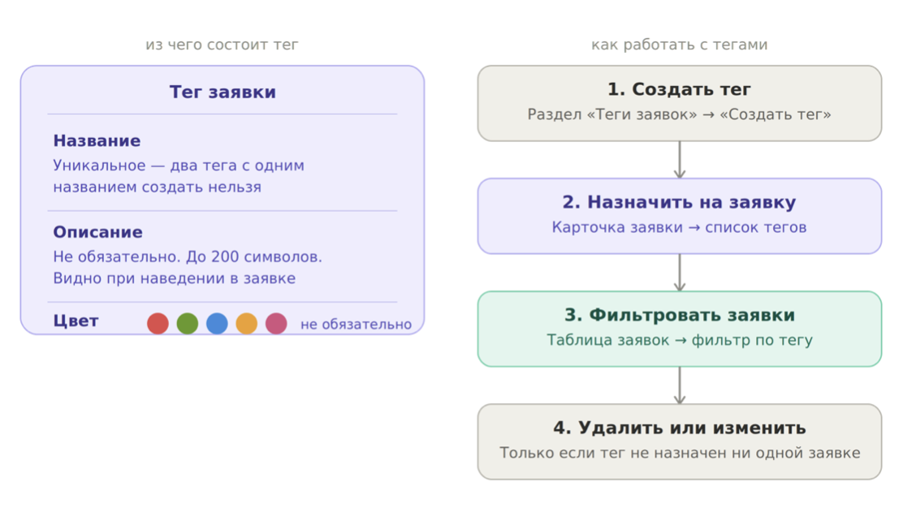
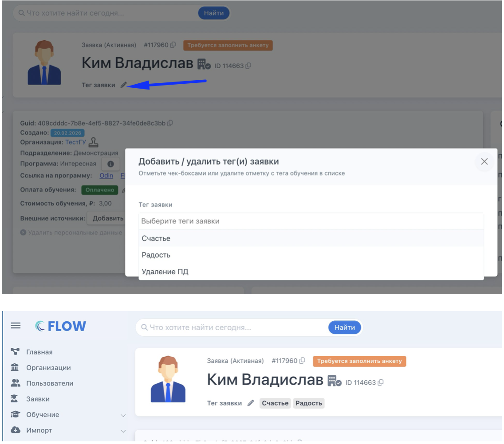
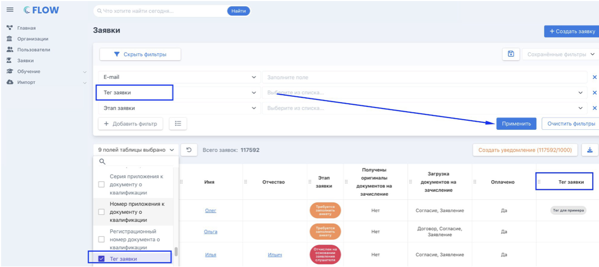
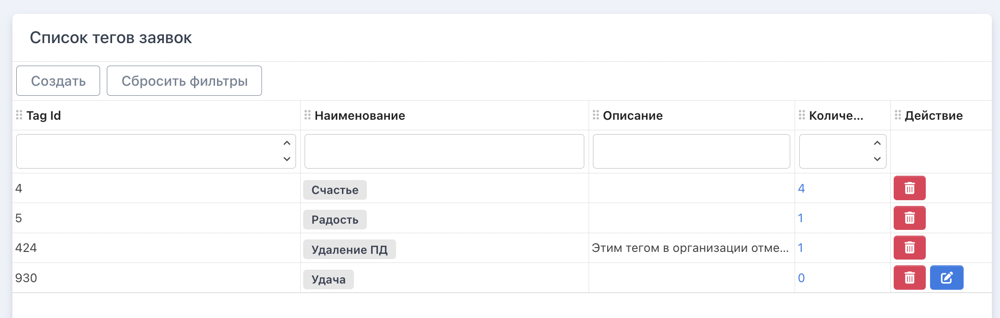

Теги -- это метки, которые помогают быстро находить и группировать заявки. Например, можно пометить заявки из определённого источника, с особым статусом или требующие внимания. У каждой организации свой независимый список тегов.

{width=1112px height=646px}

## Как создать тег?

**Перейдите в раздел «Теги заявок» в левом меню -> нажмите «Создать тег».**

**Заполните поля:**

-  Название -- обязательное. Должно быть уникальным: два тега с одинаковым названием создать нельзя.

-  Описание -- необязательное, до 200 символов. Отображается при наведении на тег в карточке заявки и в таблице заявок -- удобно для подсказок коллегам.

-  Цвет -- необязательный. Один цвет может быть у нескольких тегов

{width=1080px height=601px}

:::danger 

Нельзя редактировать или удалить тег, если он назначен хотя бы одной заявке. Сначала снимите тег со всех заявок.

:::

## **Как назначить тег на заявку**

1. **Откройте карточку заявки.** 

2. **Нажмите на иконку карандаша рядом с полем «Тег заявки» -- откроется модальное окно со списком тегов.** 

3. **Отметьте нужные теги и сохраните.**

{width=1136px height=1002px}

:::info 

У заявки может быть несколько тегов одновременно.

:::

## Как использовать теги для поиска

**В таблице заявок есть два инструмента для работы с тегами:**

-  **Фильтр «Тег заявки»** -- нажмите «Показать фильтры» над таблицей, добавьте фильтр «Тег заявки», выберите нужный тег из списка и нажмите «Применить».

-  **Столбец «Тег заявки»** -- добавьте его в таблицу через настройку столбцов. Теги будут отображаться прямо в списке заявок.

{width=1124px height=502px}

## **Как удалить или изменить тег**

**Перейдите в раздел «Теги заявок». Удалить или изменить тег можно только если он не используется ни в одной заявке.**

**Если тег назначен заявкам -- сначала снимите его с каждой заявки вручную, затем вернитесь к удалению/редактированию.**

{width=2088px height=664px}