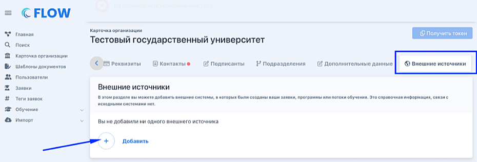
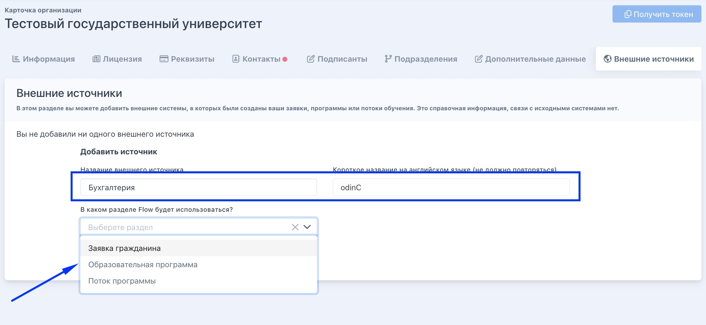
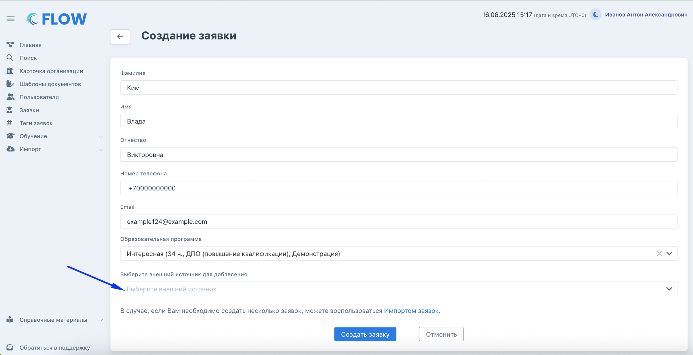
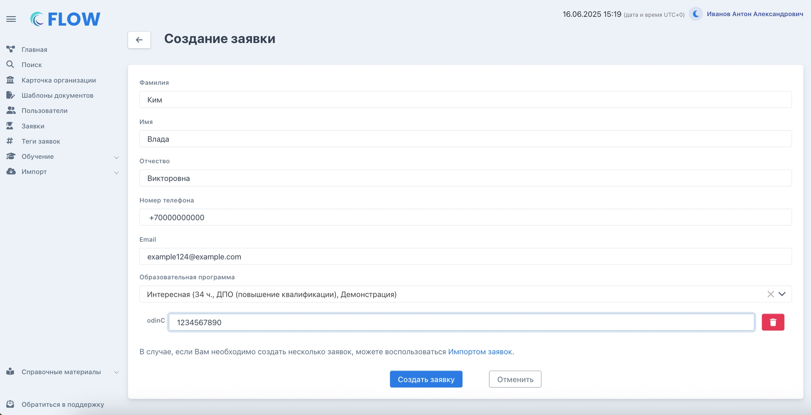
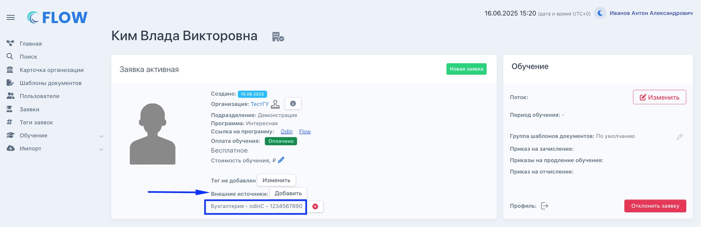
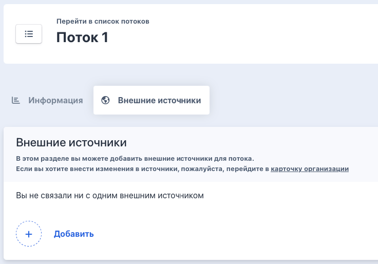

:::info 

**Внешний источник** - это идентификатор внутри другой системы, где организация может вести работу с заявками, программами, потоками (периодами обучения) параллельно работе во Flow.

Чтобы быстро найти заявки/потоки/программы в разных системах, можно использовать внешние источники во Flow.

:::

## Шаг 1. Создание внешних источников

На странице организации в разделе "Внешние источники" необходимо нажать "Добавить".

{width=930px height=316px}

-  Запонить:

   -  название внешнего источника (рекомендуем написать название той системы, информацию о которой хотите добавить во Flow), понятное сотрудникам организации;

   -  короткое название на латинице: это название будет использоваться внутри.

-  Выбрать раздел, где будет использоваться "Внешний источник".

{width=2160px height=996px}

## **Шаг 2. Добавление внешних источников**

[tabs]

[tab:Заявка]

Внешний источник можно выбрать при создании заявки

{width=2304px height=1184px}

Затем ввести значение и создать заявку

{width=2304px height=1180px}

На странице заявки появится введенное значение.

Возможно добавить несколько "Внешних источников".

{width=2304px height=749px}

[/tab]

[tab:Образовательная программа]

Добавление нового функционала пока в работе

[/tab]

[tab:Поток программы]

Внешний источник можно выбрать на странице потока во вкладке «Внешние источники».

{width=736px height=514px}

Можно использовать те источники, которые были заранее созданы в карточке организации. При добавлении надо выбрать источник и указать его номер. 

{width=812px height=370px}

[/tab]

[tab]

[/tab]

[/tabs]

