:::info 

**Что такое внешние источники?**

**Внешние источники** -- это дополнительные данные, которые организация хочет собирать вместе с заявкой, но которые слушатель не вводит сам в ЛК. Например: промокод, код партнёра или любой другой идентификатор.

Данные во внешний источник могут попасть следующими способами:

-  **Автоматически** -- через форму на лендинге (если она настроена с передачей этого поля), с портала Работа России (если организация использует [интеграцию с РР](./../integracii/aktivnye-mery-po-sodeystviyu-zanyatosti/integraciya-s-portalom-rabota-rossii/_index) и работает в проекте АМСЗ)

-  **Вручную** -- менеджер вносит значение прямо в карточке

-  **Через импорт заявок** -- при загрузке Excel-файла можно заполнить колонки, соответствующие внешним источникам, и их значения будут импортированы вместе с заявкой

Значения из внешних источников можно использовать в шаблонах документов через [ключевые слова.](./../Organization/Shablony/klyuchevye-slova)

:::

## Шаг 1. Создание внешних источников

На странице организации в разделе "Внешние источники" необходимо нажать "Добавить".

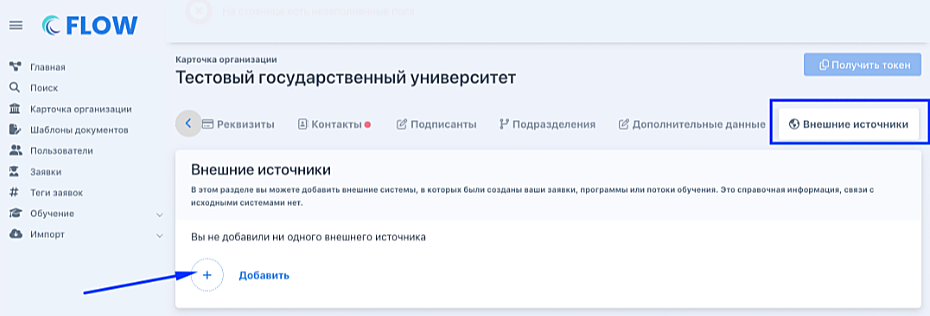{width=930px height=316px}

-  Заполнить:

   -  название внешнего источника (рекомендуем написать название той системы, информацию о которой хотите добавить во Flow), понятное сотрудникам организации;

   -  короткое название на латинице: это название будет использоваться внутри (при внесении краткого наименования не надо добавлять никакие сторонние символы!)

-  Выбрать раздел, где будет использоваться "Внешний источник".

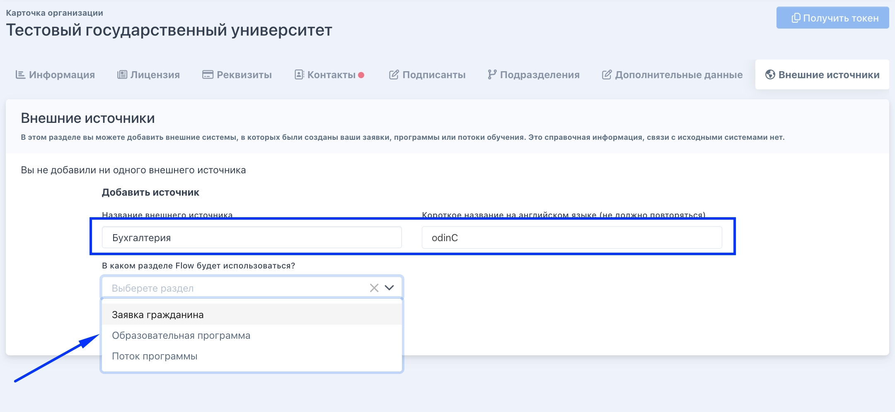{width=2160px height=996px}

## **Шаг 2. Добавление внешних источников**

[tabs]

[tab:Заявка]

Внешний источник можно выбрать при создании заявки.

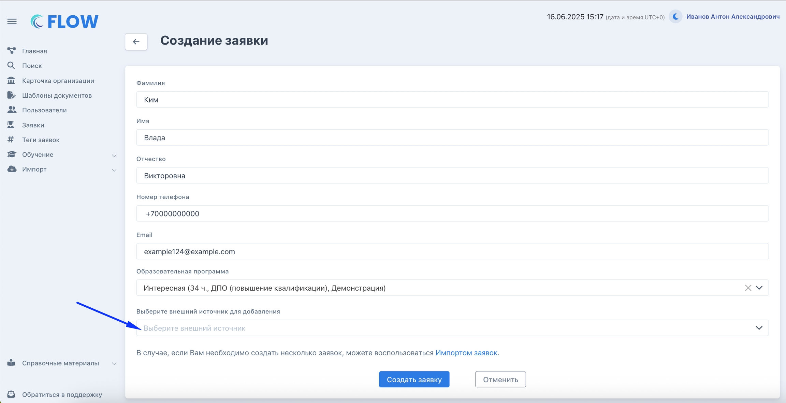{width=2304px height=1184px}

Затем ввести значение и создать заявку

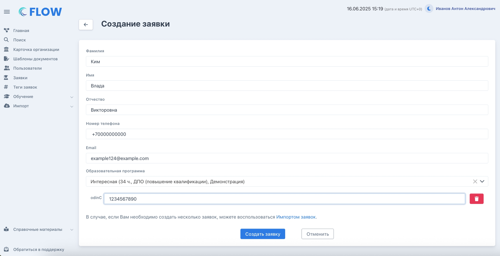{width=2304px height=1180px}

На странице заявки появится введенное значение.

Возможно добавить несколько "Внешних источников".

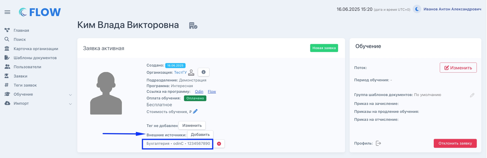{width=2304px height=749px}

[/tab]

[tab:Программа]

Внешний источник можно выбрать на странице программы во вкладке «Внешние источники».

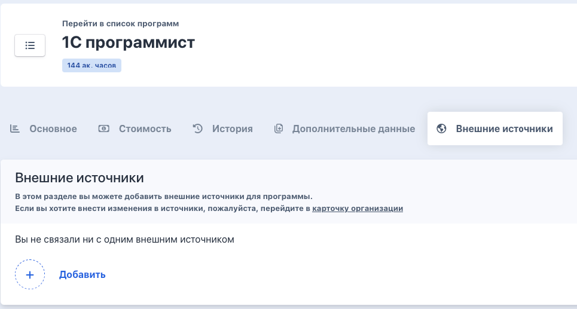{width=965px height=517px}

Можно использовать те источники, которые были заранее созданы в карточке организации. При добавлении надо выбрать источник и указать его номер.

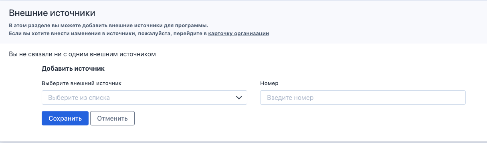{width=1215px height=358px}

Добавленные ранее источники можно удалять. Перед удалением высветится предупреждение.

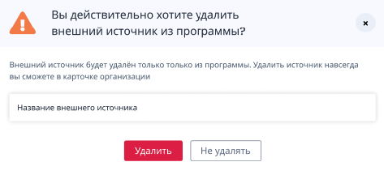{width=473px height=221px}

У программы может быть несколько уникальных источников. Один источник может быть у нескольких программ.

[/tab]

[tab:Поток]

Внешний источник можно выбрать на странице потока во вкладке «Внешние источники».

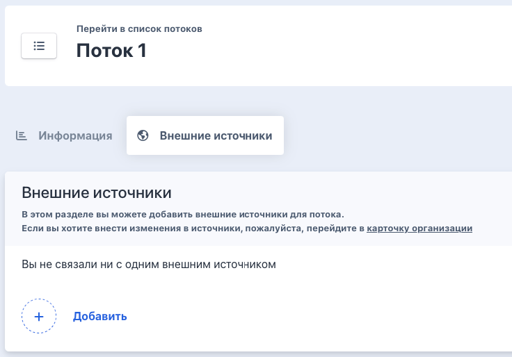{width=736px height=514px}

Можно использовать те источники, которые были заранее созданы в карточке организации. При добавлении надо выбрать источник и указать его номер.

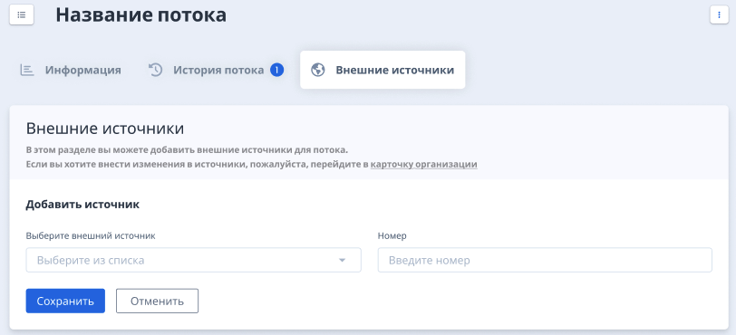{width=812px height=370px}

Добавленные ранее источники можно удалять. Перед удалением высветится предупреждение.

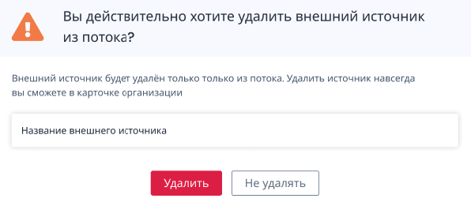{width=596px height=275px}

У потока может быть несколько уникальных источников. Один источник может быть у нескольких потоков.

[/tab]

[tab:Импорт]

Внешний источник можно указать через файл импорта заявок. Для этого надо добавить столбец (столбцы) и назвать кратким названием внешнего источника, который был указан при создании.

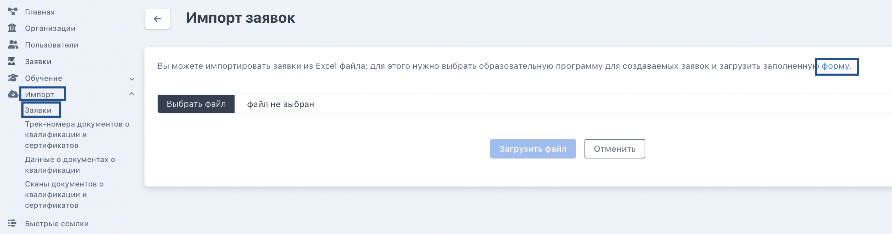{width=2506px height=660px}

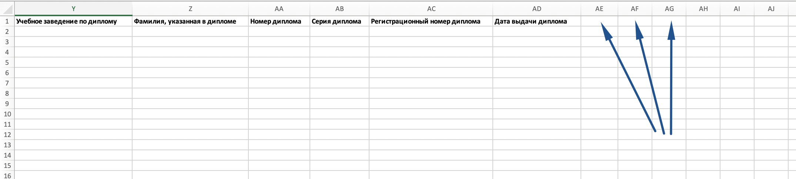{width=2150px height=486px}

[/tab]

[/tabs]

## Шаг 3. Использование внешних источников в шаблонах документов

У короткого названия внешнего источника есть символы параграфа, как это сделано для ключевых слов. Можно скопировать короткое название внешнего источника. Такая возможность есть в организации (на скрине), программе, потоке.

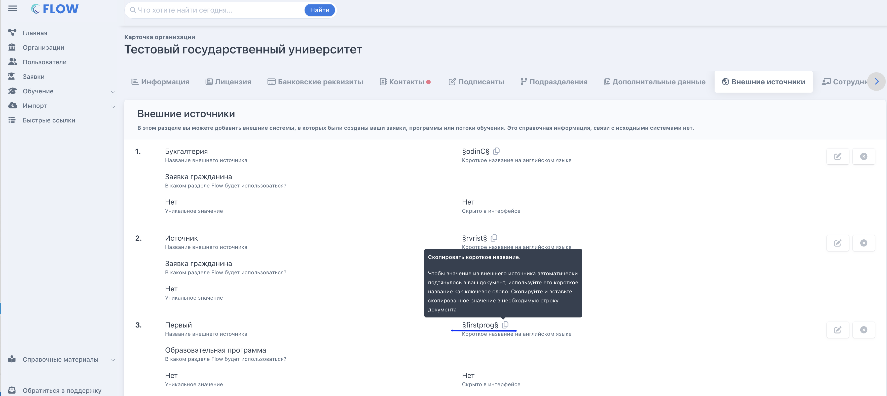{width=3524px height=1578px}

После копирования ключевого слова его можно вставить в [шаблон документа](./../Organization/Shablony/sozdanie-sobstvennykh-shablonov) -> при генерации документа для слушателя вместо ключевого поля подставится соответствующее ему значение.

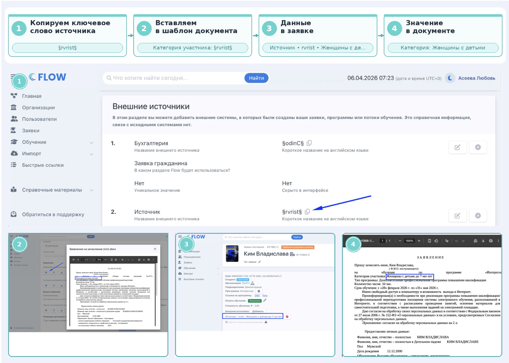{width=1474px height=1052px}

---

## Пример использования внешнего источника на лендинге

:::info 

Изучите инструкцию по настройке [формы сбора заявок](./../Organization/Token/forma-sbora-zayavok-na-saite-organizacii)  и [пример для Tilda](./../Organization/Token/forma-sbora-zayavok-na-primere-tilda/_index)

:::

Чтобы заявки с лендинга передавали в Flow дополнительные данные (например, промокод или вопрос слушателя), необходимо настроить внешние источники и связать их с HTML-формой на странице. Ниже описан пример такой настройки.

### Шаг 1. Создайте внешние источники в организации

На странице организации перейдите на вкладку «Внешние источники» и создайте два источника:

-  «Задать вопрос о программе» -- с коротким названием, например, Question

-  «Промокод» -- с коротким названием, например, Promo

При создании выберите раздел «Заявка гражданина». Значения -- не уникальные.

**Важно:** короткое название внешнего источника -- это ключевое слово, которое связывает форму на лендинге и Flow. Именно его нужно будет указать в HTML-коде формы. В коротком названии не используйте сторонние символы -- только латиница.

### Шаг 2. Добавьте поля в HTML-форму на лендинге

В код HTML-формы (например, на Тильде) после поля «Телефон» добавьте новые поля. В атрибуте name каждого поля укажите короткое название соответствующего внешнего источника из Flow:

\<label for="question">Задать вопрос о программе:\</label>

\<input type="text" name="Question" required>\ \ 

\<label for="promo">Промокод:\</label>

\<input type="text" name="Promo" required>\ \ 

Значение атрибута name (Question, Promo) должно точно совпадать с коротким названием внешнего источника, созданного в Flow, -- именно так система понимает, в какое поле записать данные.

### Шаг 3. Проверьте работу формы

Обновите страницу лендинга, заполните все поля формы и отправьте тестовую заявку. Убедитесь, что:

-  на странице лендинга появилось сообщение об успешной отправке;

-  в Flow создалась заявка;

-  в карточке заявки в блоке «Внешние источники» отображаются значения, введённые в форме.