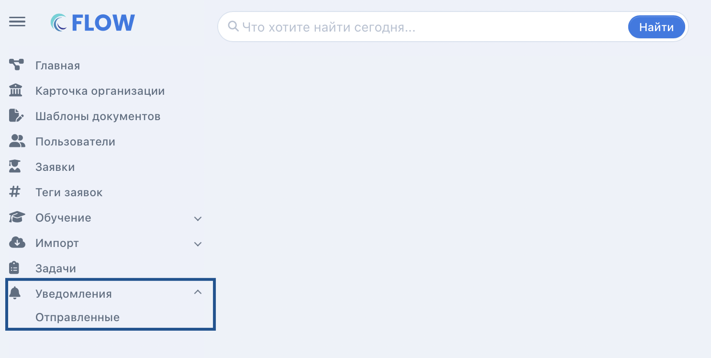

В системе есть возможность создавать и отправлять рассылки

Целью рассылки уведомлений может быть напоминание слушателям о том, что необходимо отправить какие-либо документы либо сделать какие-либо действия. Отправка уведомлений доступна по страницы списка заявок по кнопке "Отправить уведомление". Можно отфильтровать заявки по требуемым параметрам, нажать "Примените настройки" и далее "Отправить уведомление".

.png>)

Надо заполнить все необходимые поля в открывшемся окне и нажать "Создать и отправить".

Информация обо всех отправленных массовых рассылках доступна в меню «Уведомления» - «Отправленные».

{width=1486px height=748px}