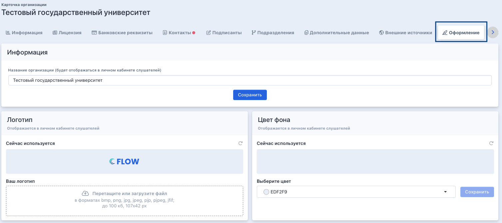

Организация может самостоятельно через карточку организации задать логотип, фирменный цвет и отображаемое название. И это применяется в личном кабинете слушателя.

В карточке организации есть вкладка «Оформление», в ней три блока.

{width=1507px height=671px}

**Блок Название организации**

В поле «Название организации (будет отображаться в личном кабинете слушателей)» по умолчанию стоит заполненное название из карточки организации из поля «Наименование», но можно ввести и другое название (может быть длинным) и нажать на «Сохранить». Тогда именно это название будет отображаться в ЛК слушателя.

**Блок Логотип**

Логотипом по умолчанию отображается заставка Flow. Но можно в дроп-зону загрузить свой лого.

Форматы файлов, которые можно загрузить: jpg, jpeg, svg, png, webp; размер до 100kb; ширина, высота 107х42 px. Если загрузили свое лого большого или маленького размера, то оно будет автоматически сжиматься до 107х42 px.2. После загрузки изображения надо нажать на «Сохранить».

Всегда можно вернуться к отображению логотипа Flow.

**Блок Цвет фона**

По умолчанию в ЛК отображается поле с фоном Flow, но можно выбрать свой.

При выбора цвета открывается панель, где можно выбрать или ввести название цвета. После выбора цвета надо нажать на «Сохранить».

Всегда можно будет вернуться к отображению фона Flow.

:::info 

Данный функционал доступен только пользователям с ролью Администратор организации.

:::