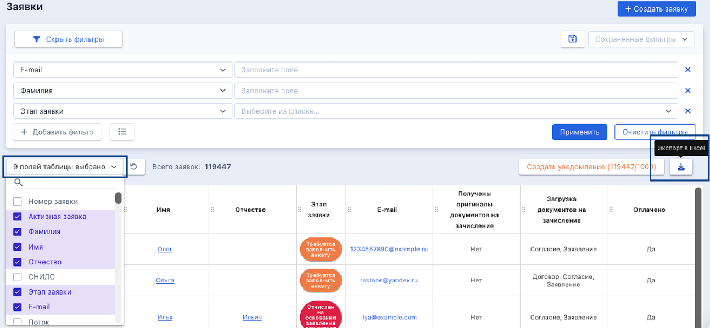

Для получения выгрузки надо перейти [на страницу заявок](https://www.flow-crm.study/Requests/RequestsList), выбрать необходимые поля таблицы, нажать кнопку «Экспорт в Excel».

{width=1293px height=598px}