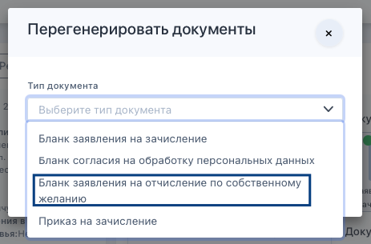

Сотрудник образовательной организации может сгенерировать и скачать (или распечатать) бланк заявления на отчисление по СЖ прямо в карточке слушателя. Надо перейти в блок со сканами документов, нажать кнопку «Действия с документами», выбрать «Перегенерировать документ».

{width=560px height=191px}

Затем нажать на необходимый тип документа.

{width=463px height=305px}

Условия, при которых этот пункт будет доступен сотруднику:

-  если у слушателя есть приказ о зачислении и нет приказа об отчислении, то пункт «Бланк заявления на отчисление по собственному желанию» доступен для генерации.

-  если приказа о зачислении ещё нет, или слушатель уже отчислен, то пункт недоступен.

**При первой генерации** дата в бланке = текущей дате.

После генерации бланка он также отобразится в ЛК Слушателя в блоке "Мои документы».