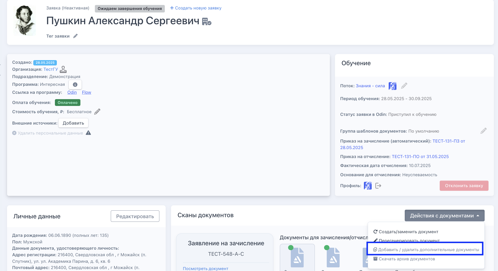
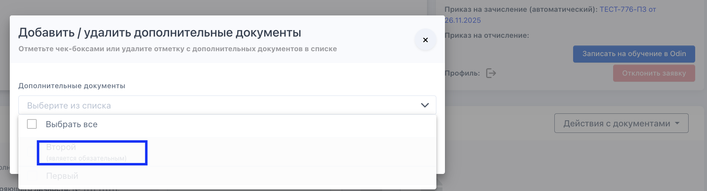
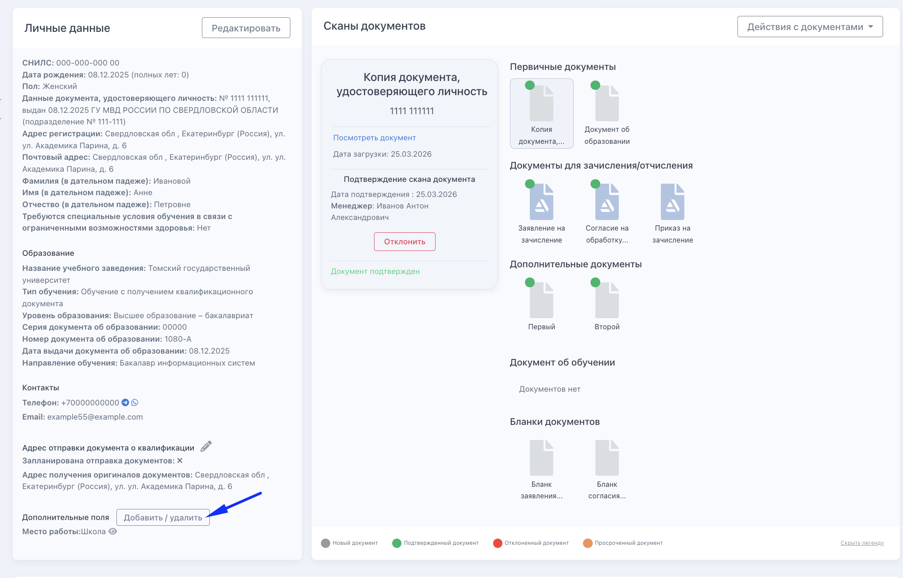
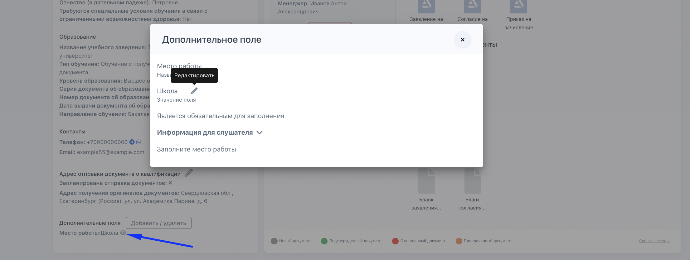

## 

:::info 

Дополнительные документы или поля добавляются автоматически во все новые заявки программы. [Подробнее](./../Organization/dopolnitelnye-dokumenty-i-polya-vvoda-dannykh/_index)

Если доп.поля/документы не были добавлены в программу заранее до получения/создания заявки, их можно добавить вручную прямо в карточке конкретной заявки.

:::

### Управление документами в заявке

В карточке заявки перейдите в блок **«Сканы документов»** -> **«Действия с документами»** -> **«Добавить/удалить дополнительные документы»**.

{width=2050px height=1118px}

В выпадающем списке выберите, какие документы добавить, а какие удалить.

{width=1732px height=470px}

Важно учитывать:

-  Документы, уже добавленные в заявку, выбрать не получится

-  Нельзя удалить документ, если слушатель уже загрузил по нему файл в ЛК

-  Если документ загружен с ошибкой -- его можно только отклонить с комментарием, чтобы слушатель загрузил заново

---

### Управление полями в заявке

В карточке заявки перейдите в блок **«Личные данные»** -> **«Добавить/удалить дополнительные поля»**.

{width=2040px height=1306px}

В списке выберите, какие поля добавить или удалить.

Важно учитывать:

-  Поля, уже добавленные в заявку, в списке не отображаются

-  Нельзя удалить поле в организации, если слушатель уже заполнил его в ЛК

-  Если поле заполнено с ошибкой -- сотрудник может отредактировать значение сам, либо удалить его значение, чтобы слушатель заполнил заново через ЛК

{width=2212px height=834px}