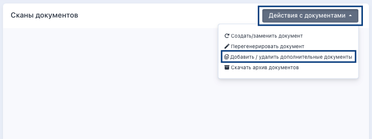
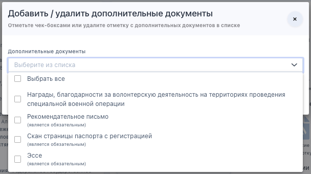
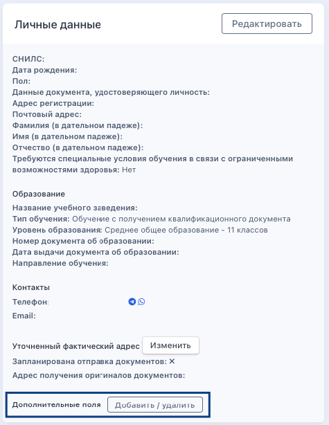
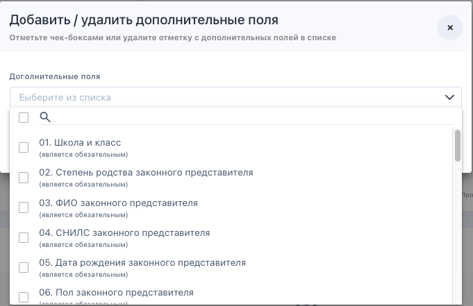

На странице заявки также можно добавить/удалить дополнительные документы и поля. Сделать это можно из соответствующих блоков.

Дополнительные документы добавляются/удаляются из блока «Сканы документов» по клику на «Действия с документами» - «Добавить/удалить дополнительные документы».

{width=739px height=277px}

Далее в выпадающем списке выбрать, какие именно дополнительные документы необходимо добавить, а какие удалить. Если какие-то документы уже были выбраны  в заявке, то в списке они не отобразятся. Нельзя удалить дополнительные документы, по которым заявка уже сохранила на Шаге ЛК загруженные документы. Если в дополнительных документах обнаружилась ошибка/опечатка, организация может только отклонить ошибочные документы с комментарием, чтобы слушатель загрузил их заново.

{width=608px height=340px}

Из блока «Личные данные» можно добавить/удалить дополнительные поля.

{width=475px height=614px}

Откроется список с дополнительными полями, которые можно добавить/удалить. Если какие-то поля уже выбраны  в заявке, то в списке они не отобразятся. Нельзя удалить дополнительные поля, которые заявка уже сохранила на Шаге ЛК. Если в дополнительных полях обнаружилась ошибка/опечатка, у организации есть возможность отредактировать заполненные слушателем данные. Если  поле заполнено неправильно и необходимо, чтобы его через ЛК отредактировал сам слушатель, то надо в заявке удалить значение и тогда у слушателя появится возможность заполнить поле снова.

{width=681px height=441px}

### **Управление полями в заявке**

#### **Управление ДОКУМЕНТАМИ в заявке**

В карточке заявки -> блок «Сканы документов» -> «Действия с документами» -> «Добавить/удалить дополнительные документы».

Важно учитывать:

-  Нельзя удалить документ, если слушатель уже загрузил по нему файл в ЛК

-  Если документ загружен с ошибкой -- его можно только отклонить с комментарием, чтобы слушатель загрузил заново

#### Управление ПОЛЯМИ в **заявке**

В карточке заявки -> блок «Личные данные» -> «Добавить/удалить дополнительные поля».

Важно учитывать:

-  Нельзя удалить поле, если слушатель уже заполнил его в ЛК

-  Если поле заполнено с ошибкой -- сотрудник может отредактировать значение сам, либо удалить значение, чтобы слушатель заполнил  его заново через ЛК.