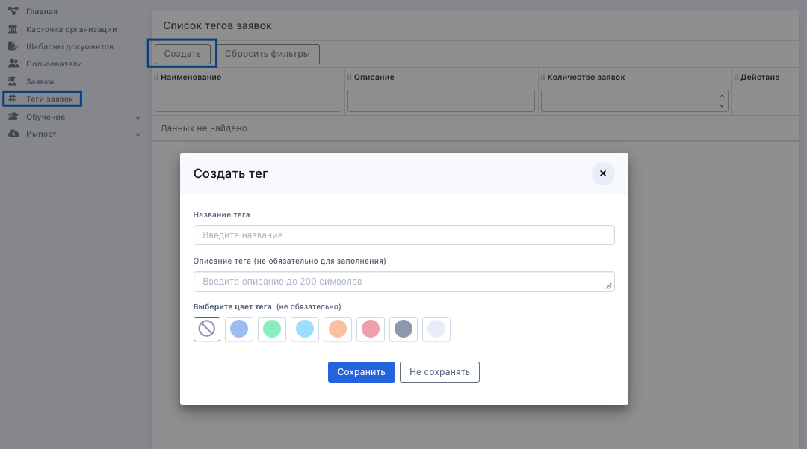

Для создания тега надо на странице Теги заявок нажать на «Создать тег». 

{width=1080px height=601px}

Откроется модальное окно с полями:\
**Название тега (обязательное)**\
Не может быть двух тегов с одним и тем же названием, название должно быть уникальным.\
**Описание тега (не обязательное)**\
Тег может быть создан без описания. Если же описание добавлено, то оно будет отображено не только в таблице тегов, но и при **наведении на тег в заявке, а также в таблице заявок**. Длина такого описания не может превышать 200 символов.

**Цвет статуса** **(не обязательное)**\
Есть возможность выбора цвета тега. Один цвет может быть у нескольких тегов.

:::danger 

Нельзя удалить и редактировать тег, если он использован хотя бы в одной заявке. 

Можно удалить тег, если он не используется ни в одной заявке.

:::