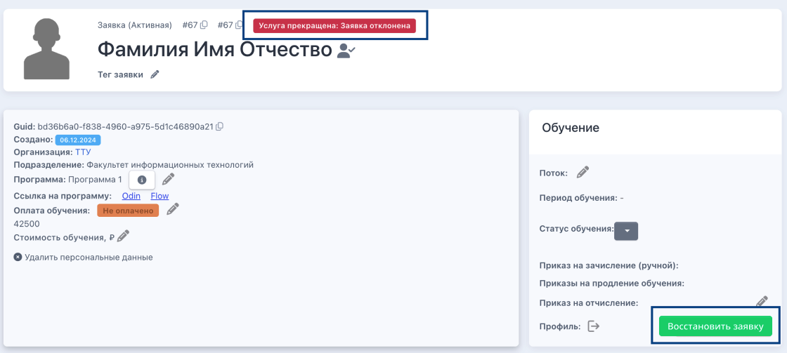

На этапе "Услуга прекращена. Заявка отклонена" доступна кнопка «Восстановить заявку».

{width=1120px height=503px}

Возможности "Восстановить заявку» не будет на этапах "Отчислен: за неуспеваемость", "Отчислен на основании заявления слушателя", "Обучен - услуга оказана". 

**Как это применимо к восстановлению случайно отклоненной заявки:** если заявку отклонили, а затем в системе создали новую заявку с таким же набором данных, то ранее отклоненную заявку по кнопке восстановить будет нельзя, так как с таким набором данных уже существует активная заявка.