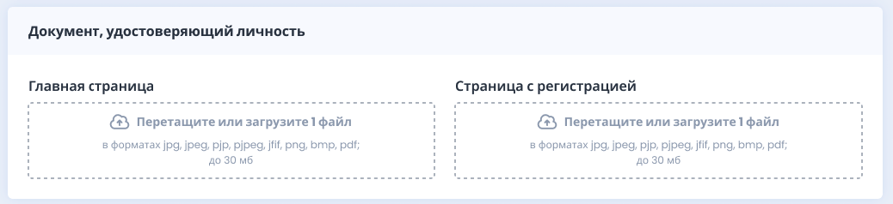
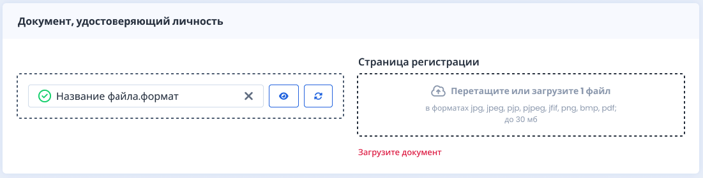
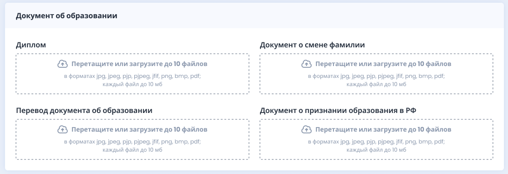
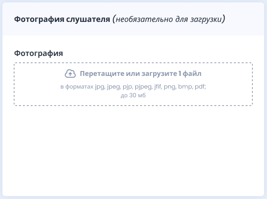
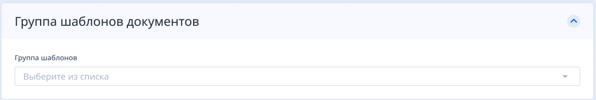

Актуально для нового ЛК

:::info 

Каждый из загруженных ранее документов можно будет впоследствии заменить, не перезагружая весь пакет документов.

:::

Блок **Документ, удостоверяющий личность**, для загрузки скана или фотографии паспорта “Главная страница” и “Страница регистрации”. **Показывается этот блок, если тип обучения "С получением документа о квалификации".**

{width=1038px height=238px}

**Показываем блок, если тип обучения "С получением документа о квалификации".**\
Если в блоке паспорта загрузили хотя бы 1 документ, то высвечивается ошибка о необходимости загрузки следующего документа в соответствующем блоке исходя из того, что если у организации есть главная страница паспорта, то и страница с регистрацией тоже должна быть.

{width=1101px height=280px}

Блок **Документ об образовании** показывается, **если тип обучения "С получением документа о квалификации".**

{width=1112px height=382px}

И можно загрузить:

-  “Диплом”

-  “Документ о смене фамилии” (появляется, если прожат флажок «Изменена фамилия после выдачи документа об образовании»)

-  “Перевод документа об образовании” (появляются, если прожат флажок «Документ об образовании на иностранном языке»)

-  "Документ о признании образования в РФ” (появляются, если прожат флажок «Документ об образовании на иностранном языке»)

Если загружен только скан документа об образовании, но при этом прожаты чек-боксы документа о смене фамилии и документа об иностранном языке, подсвечиваются красным дроп-зоны этих документов. Таким образом нельзя при прожатых чек-боксах загрузить только скан диплома.

**Фотография слушателя** (необязательно для загрузки). 

{width=549px height=409px}

Если у организации больше 1 группы шаблонов документов, то перед блоками с загрузкой отображается **блок «Группа шаблонов документов»**. 

{width=1099px height=186px}

**Дополнительные документы - этот блок показывается,** если у программы заявки есть дополнительные документы. На странице формы даже обязательные дополнительные документы ***не обязательны для загрузки организацией***, здесь решает организация, загрузят ли они обязательные дополнительные документы в заявку самостоятельно или это сделает слушатель в своем ЛК.