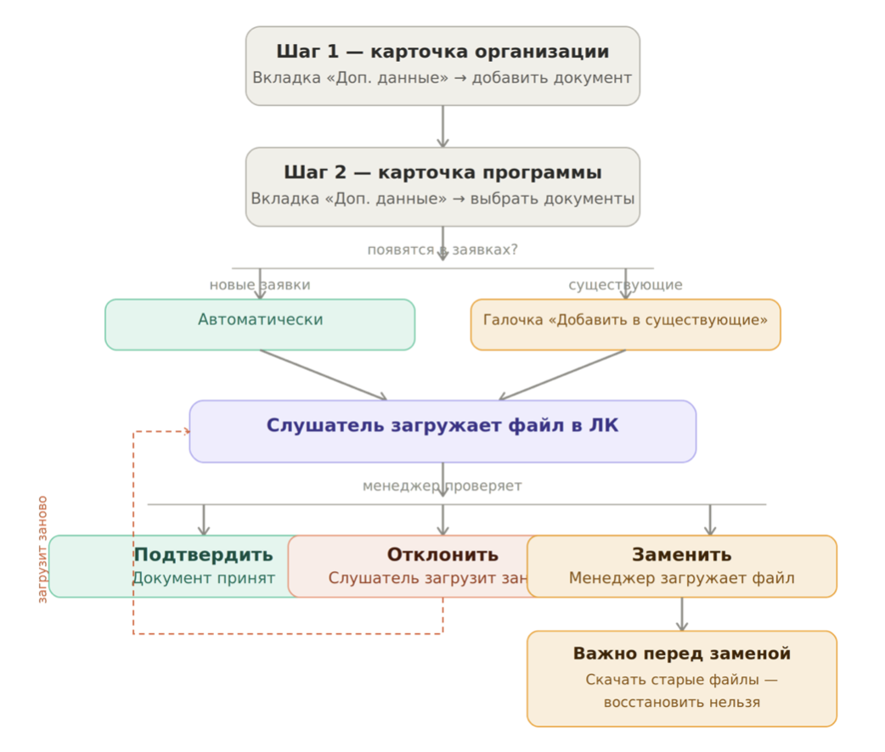
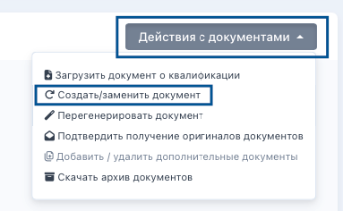
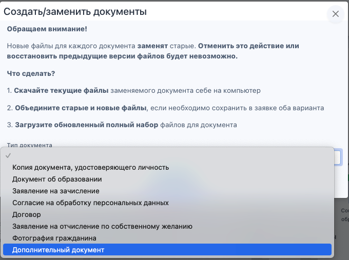

:::info 

Дополнительные документы -- это файлы, которые слушатель загружает в личном кабинете по запросу организации. Например: медицинская справка, свидетельство о рождении ребёнка, копия трудовой книжки. Набор таких документов каждая организация определяет самостоятельно.

Дополнительные документы могут быть обязательными к загрузке и необязательными. 

:::

{width=1042px height=886px}

## **Шаг 1. Создайте документы в карточке организации**

Перейдите в карточку организации -> вкладка «Дополнительные данные» -> нажмите «Добавить».

Укажите название документа и настройте обязательность. После создания документ появится в списке и будет доступен для добавления в программы.

## **Шаг 2. Добавьте документы в программу**

Перейдите в карточку программы -> вкладка «Дополнительные данные» -> выберите нужные документы из списка.

После этого документы автоматически появятся во всех новых заявках по этой программе -- слушатель увидит их в ЛК на соответствующем шаге.

**Если нужно добавить в уже существующие заявки**

1. **Все заявки сразу --** при добавлении отметьте галочку «Добавить в существующие заявки программы».

2. **Одну или несколько заявок --** перейдите в заявку -> блок «Сканы документов» -> «Действия с документами» -> «Добавить/удалить дополнительные документы».

:::info 

Нельзя удалить документ из заявки, если слушатель уже загрузил по нему файл.

:::

## **Как работать с документом в заявке**

После того как слушатель загрузил файл, менеджер может:

1. **Подтвердить** -- документ будет принят, слушатель продолжит движение в ЛК.

2. **Отклонить с комментарием** -- слушатель получит уведомление и сможет загрузить файл заново через ЛК.

3. **Заменить** -- если нужно загрузить новый файл вместо старого (подробнее в следующем разделе).

## **Как заменить дополнительный документ**

Перейдите в карточку заявки -> блок «Сканы документов» -> «Действия с документами» -> «Создать/заменить документ».

{width=383px height=236px}

Выберите тип документа «Дополнительный документ».

{width=680px height=507px}

:::info 

Перед заменой документа будет отображаться следующее предупреждение:

Обращаем внимание!

Новые файлы для каждого документа заменят старые. Отменить это действие или восстановить предыдущие версии файлов будет невозможно.

**Что сделать?**\
1\. Скачайте текущие файлы заменяемого документа себе на компьютер.\
2\. Объедините старые и новые файлы, если необходимо сохранить в заявке оба варианта заменяемого документа.\
3\. Загрузите обновленный полный набор файлов для заменяемого документа и сохраните.

:::