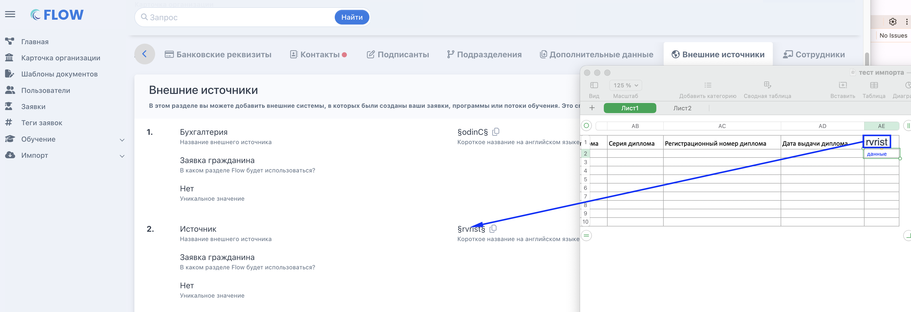
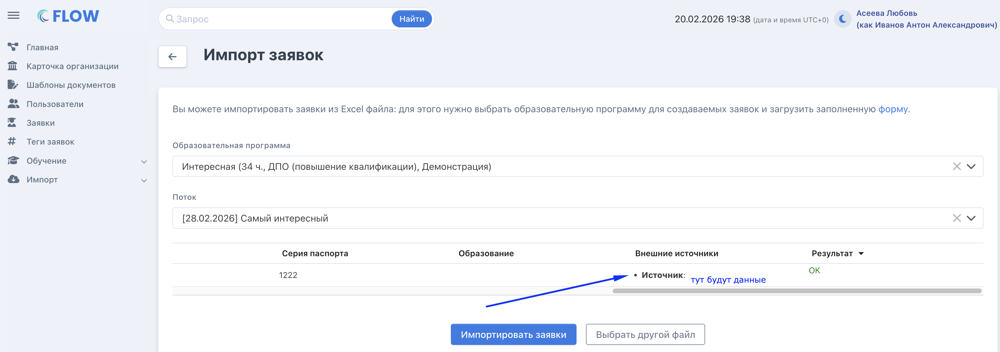

[view:hierarchy=none::::List]

Для организаций, у кого не подключено автоматическое получение заявок с портала Работа России, возможно использовать ручной импорт данных с РР. Для этого:

1. Добавьте [внешние источники](./vneshnie-istochniki/_index) в соответствии с теми полями, которые затем хотите увидеть в заявке.

2. Подготовьте файл для импорта во Flow CRM

   1. Скачайте образец файла для заполнения <https://www.flow-crm.study/Requests/ImportRequests>

   2. Добавьте в файл столбцы и назовите также как короткое название  внешнего источника на английском , исключив спец.символы:  один внешний источник = один новый столбец

   3. заполните скачанный шаблон с добавленными столбцами необходимыми данными с портала РР

{width=3606px height=1236px}

Импортируйте подготовленный файл, указав:

-  программу

-  поток (при необходимости)

При импорте  видно, что данные из файла будут отображаться в каждом внешнем источнике.

{width=3398px height=1198px}

После завершения импорта в созданные [заявки](./zayavki) подтянуться значения внешних источников, гражданам на указанную электронную почту будет направлена ссылка для входа в личный кабинет.