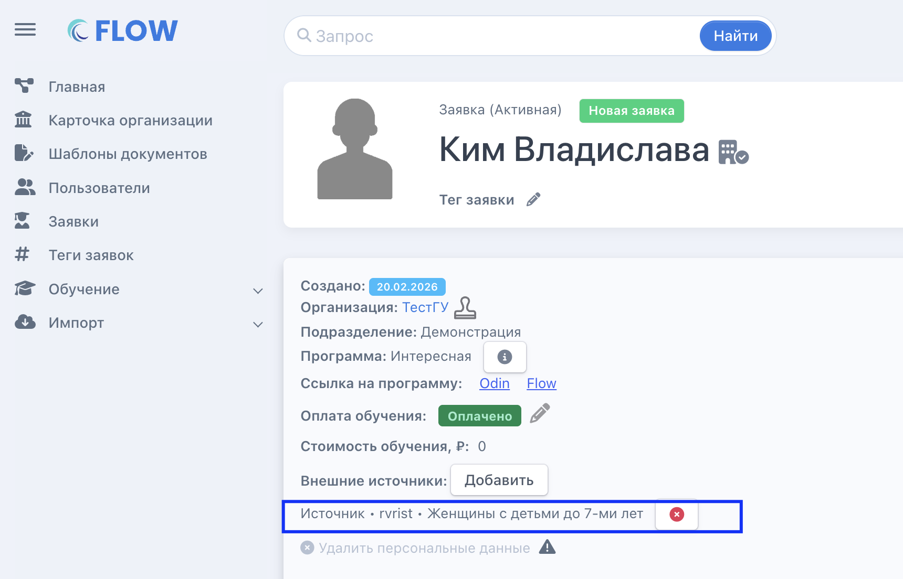
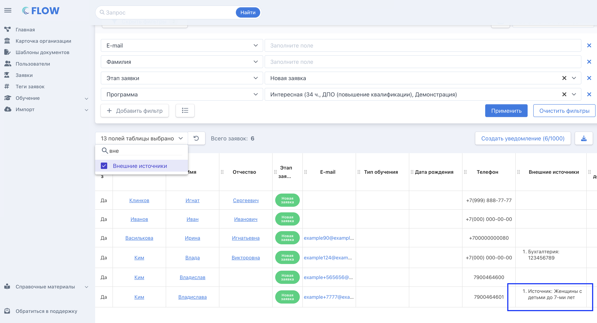
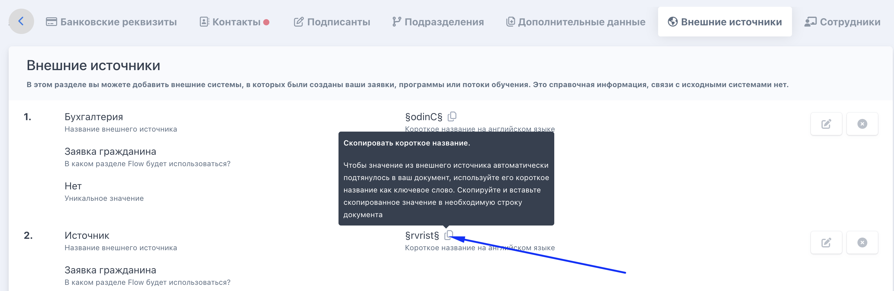
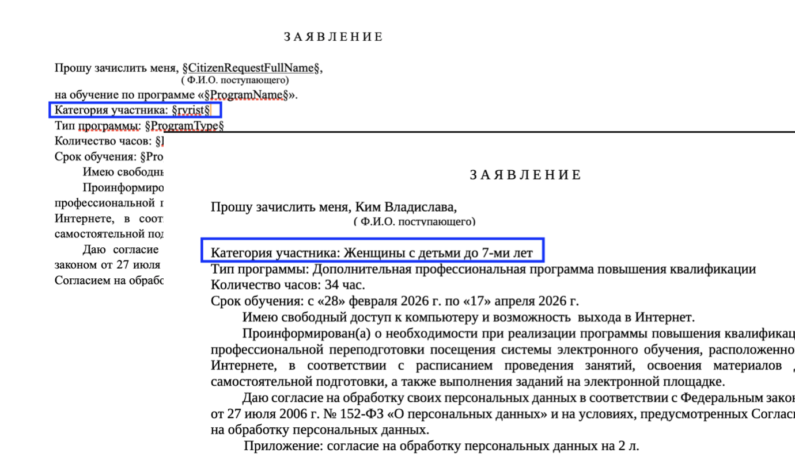

:::note 

Информация о статусе заявки не синхронизируется с РР при ручном импорте. Заявка с внешними источниками - это обычная заявка во Flow CRM.

:::

На странице заявки будут отображаться все внешние источники

{width=1720px height=1104px}

По этим данным заявки в дальнейшем заявки можно вывести в настраиваемом списке заявок

{width=3364px height=1822px}

## Как использовать внешние источники в шаблонах документов?

Шаг 1. Скопируйте ключевое слово во вкладке «Внешние источники» на странице программы

{width=2884px height=942px}

Шаг 2. Вставьте  данное ключевое слово в шаблон документа.

При генерации ключ внешнего источника будет заменен данными из внешнего источника в самой заявке.

{width=1380px height=814px}