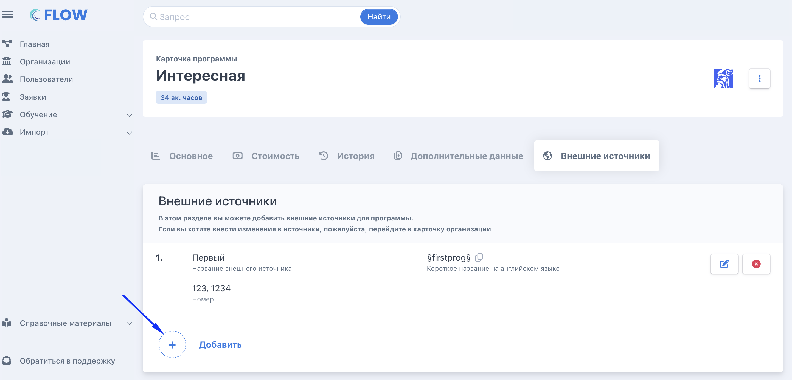

1. Создать во Flow новые программы и потоки на 2026 год, привязав к ним новые шаблоны договоров.

2. Создать аналогичные карточки программ на портале РР, скопировать оттуда GUID.

3. Внести эти GUID в карточки программ во Flow (в поле внешних источников).

4. Передать команде Flow учетные данные (логин/пароль) для приема заявок.

   **Шаг 1. Создать  программы на РР по регионам**

   На портале «Работа в России» необходимо:

   -  создать отдельные программы для каждого региона;

   -  убедиться, что программы доступны для подачи заявок;

   -  проверить корректность названий и параметров программ.

   ---

   **Шаг 2. Заполнить GUID программ**

   Для каждой созданной программы нужно:

   -  получить уникальный GUID программы с портала РР (для каждого региона, где опубликована программа, будет свой GUID - необходимо получить их все). Создать программу ->Сохранить-> в таблице программ первый столбец - это GUID (тут нужен скрин)

   -  открыть вкладку «Внешние источники» на странице программы во Flow и добавить  внешний источник «Guids программ с РР» ;

   {width=2886px height=1388px}

   -  после добавления внешнего источника  по кнопке «Редактировать» необходимо добавить полученные GUID программ (через запятую).

   {width=2878px height=1014px}

---

После этого система будет понимать, какие заявки необходимо забирать с портала РР и добавлять их во Flow CRM в нужную программу.