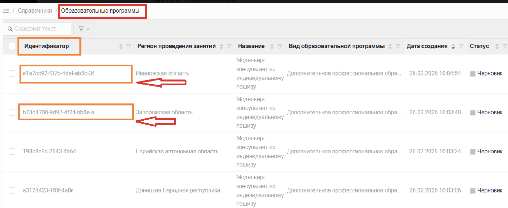
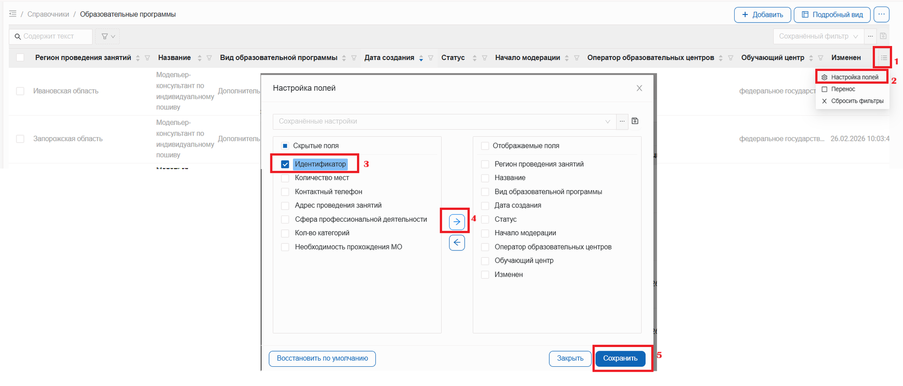
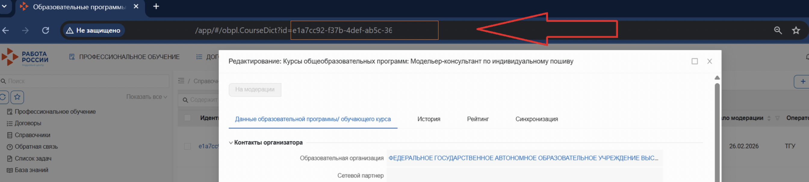

### Вариант 1. Из списка программ

В списке программ (таблице)  GUID-программы - идентификатор. Скопировать его необходимо по очереди для каждого из регионов, где заявлена программа.

{width=1938px height=796px}

 Если такой колонки нет в таблице с программами, то её можно необходимо добавить, используя инструкцию ниже.

{width=1920px height=822px}

### Вариант 2. Из карточки программы

Если открыта карточка программы, то этот идентификатор (GUID) есть в адресной строке браузера после знака равно `=`

{width=2688px height=606px}