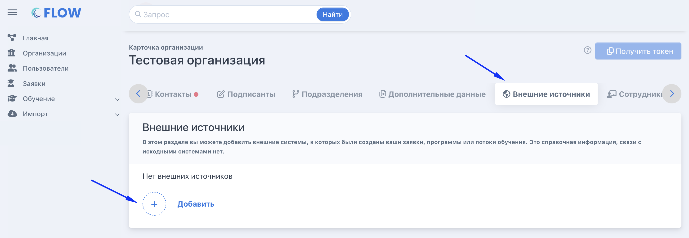

На странице организации во вкладке «Внешние источники» необходимо добавить все пункты в соответствии с таблицей.

{width=2910px height=1008px}

| №  | Название поля        | Название внешнего источника (код) | Короткое название (EN) | Раздел Flow               | Используется в разделе Flow | Уникальное значение | Скрыто в интерфейсе |
|----|----------------------|-----------------------------------|------------------------|---------------------------|-----------------------------|---------------------|---------------------|
| 1  | ЦЗН                  | §czn§                             | czn                    | Заявка гражданина         | Нет                         | Нет                 | Нет                 |
| 2  | Категория гражданина | §kat§                             | kat                    | Заявка гражданина         | Нет                         | Нет                 | Нет                 |
| 3  | Guids программ с РР  | §RvrProgramGuids§                 | RvrProgramGuids        | Образовательная программа | Нет                         | Нет                 | Нет                 |
| 4  | Номер заявки на РР   | §nom§                             | nom                    | Заявка гражданина         | Да                          | Нет                 | Нет                 |
| 5  | Регион обращения     | §reg§                             | reg                    | Заявка гражданина         | Нет                         | Нет                 | Нет                 |
| 6  | GUID заявки в РВР    | §RvrRequestGuid§                  | RvrRequestGuid         | Заявка гражданина         | Да                          | Нет                 | Нет                 |
| 7  | Статус заявки на РР  | §sta§                             | sta                    | Заявка гражданина         | Нет                         | Нет                 | Нет                 |
| 9  | Guid программы с РР  | §RvrProgramGuid§                  | RvrProgramGuid         | Заявка гражданина         | Нет                         | Нет                 | Нет                 |
| 10 | Дата договора        | §DataDoc§                         | DataDoc                | Заявка гражданина         | Нет                         | Нет                 | Нет                 |

👉 Эти поля не заменяют стандартные поля заявки/программе, а дополняют их.