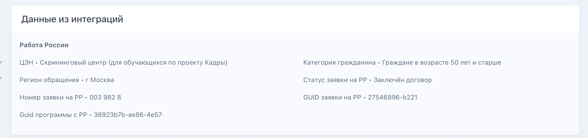

:::note 

При включенной интеграции **запрещается** импортировать заявки **вручную**.

Необходимо дождаться, когда заявка поступит во Flow CRM в автоматическом режиме.

:::

В заявке, автоматически импортированной с портала Работа России, в отдельном блоке  «Д**анные из интеграций**» на странице заявки  будут  отображаться  дополнительные  данные

{width=2418px height=570px}

### Как часто приходят данные?

Данные планируется обновлять каждый час. То есть раз в час будут поступать новые заявки и проверяться статус по уже созданным.

### Какие данные обновляются?

Обновляется только статус по заявке, остальные данные приходят единожды в момент создания заявки

### Что если на РР услуга прекращена?

На РР услуга прекращена то и во Flow CRM заявка перейдёт в статус «Услуга прекращена»

**До зачисления**: по заявке во Flow CRM придет конечный статус «Услуга прекращена»

**После зачисления**:  если в заявке есть приказ на зачисление и с РР придёт статус, что услуга прекращена (например, если человек расторгнет договор о намерениях на РР уже после добавления приказа на зачисление/ во Flow CRM добавят приказ о зачислении и пока будут вносить его на РР заявка человека станет неактивной), необходимо добавить в заявки фиктивный приказ об отчислении для корректного закрытия.