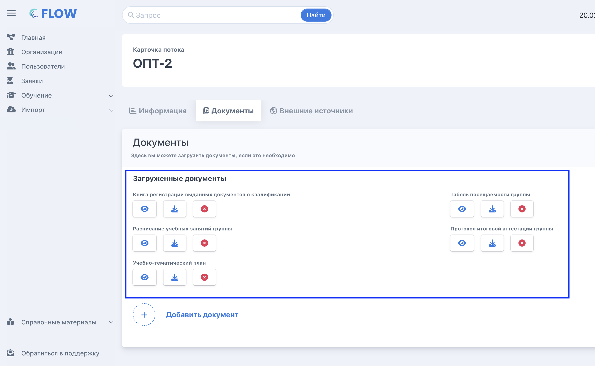

:::note 

Информация по интеграции с ВНИИ Труда актуальна только на 2025 год. Для 2026 года возможность интеграции уточняется

:::

:::info 

Данная интеграция является платной. Информацию о стоимости уточните у менеджера или в технической поддержке

:::

## Какие данные [highlight:mint-green]будут[/highlight] передаваться?

После завершения обучения будут передаваться

1. первым этапом данные из каждой заявки данного федерального оператора в виде полей без сканов

2. вторым этапом сканы документов из заявки ( важно отметить, будут отправлены сканы, актуальные в момент отправки)

3. третьим этапом будут отправлены документы со страницы потока

   {width=2642px height=1628px}

## Какие данные [highlight:light-pink]**не** будут[/highlight] передаваться?

Не будут передавать данные для заявок в статусе:

1. во Flow CRM - «Услуга прекращена»

2. в ЛК ВНИИ Труда «Проходит модерацию» (после отправки заявки со сканами во ВНИИ Труда, сотрудник ФО берет заявку на проверку, пока идёт проверка что-то менять или обновлять в заявке нельзя)

:::info 

На модерацию в ЛК ВНИИ Труда заявки будут отправляться автоматом после того как из Flow  CRM будут отправлены все данные.

:::