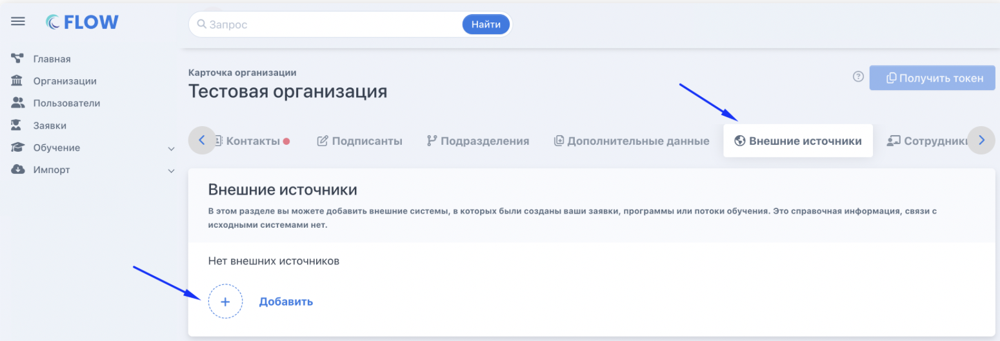

На странице организации во вкладке «Внешние источники» необходимо добавить все пункты в соответствии с таблицей.

{width=1550px height=530px}



---

*  

   №

*  

   Название поля

*  

   Название внешнего источника (код)

*  

   Короткое название (EN)

*  

   Раздел Flow

*  

   Используется в разделе Flow

*  

   Уникальное значение

*  

   Скрыто в интерфейсе

---

*  

   1

*  

   Номер заявки в ВНИИ Труда

*  

   §VNIIRequestId§

*  

   VNIIRequestId

*  

   Заявка гражданина

*  

   Да

*  

   Нет

*  

   Нет

---

*  

   2

*  

   Дата отправки в ФЕДО

*  

   §FedoDataSendTime§

*  

   FedoDataSendTime

*  

   Заявка гражданина

*  

   Нет

*  

   Да

*  

   Да

---

*  

   3

*  

   Номер программы в ВНИИ Труда

*  

   §VNIIProgramId§

*  

   VNIIProgramId

*  

   Заявка гражданина

*  

   Нет

*  

   Нет

*  

   Нет

---

*  

   4

*  

   Дата договора

*  

   §DataDoc§

*  

   DataDoc

*  

   Заявка гражданина

*  

   Нет

*  

   Нет

*  

   Нет

---

*  

   5

*  

   Статус заявки в ФЕДО

*  

   §StatusFEDO§

*  

   StatusFEDO

*  

   Заявка гражданина

*  

   Нет

*  

   Нет

*  

   Нет

---

*  

   6

*  

   Причина отклонения заявки в ФЕДО

*  

   §RejectReasonRequestFedo§

*  

   RejectReasonRequestFedo

*  

   Заявка гражданина

*  

   Нет

*  

   Нет

*  

   Нет


