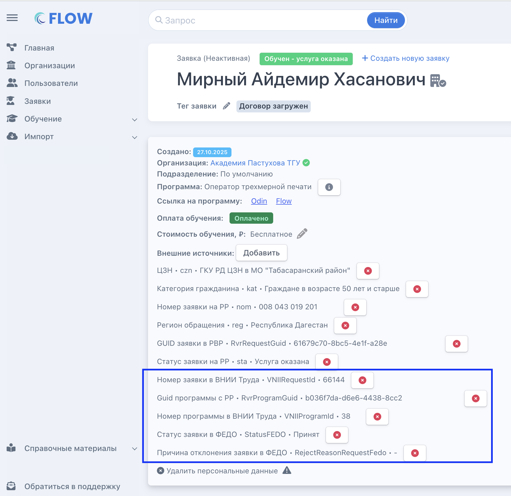
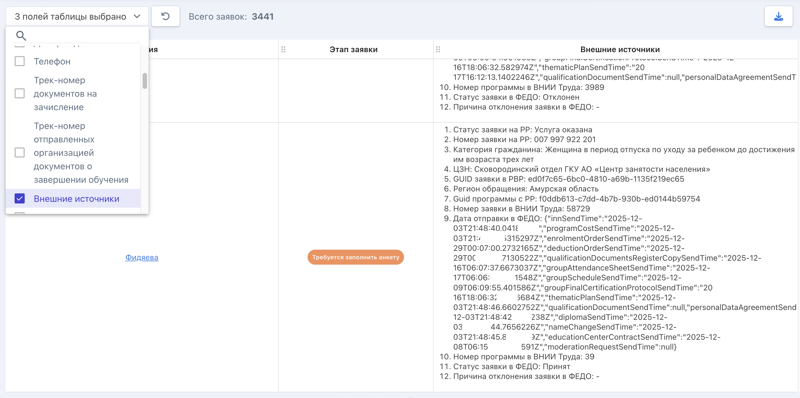

В заявке, по которой будет проходить импорт в систему ВНИИ Труда, во **внешних источниках**  будут  отображаться  дополнительные  данные

{width=1850px height=1796px}

По этим данным заявки в дальнейшем заявки можно вывести в настраиваемом списке заявок

{width=2850px height=1420px}

## Когда  будут отправляться данные?

Данные будут отправляться после даты завершения потока