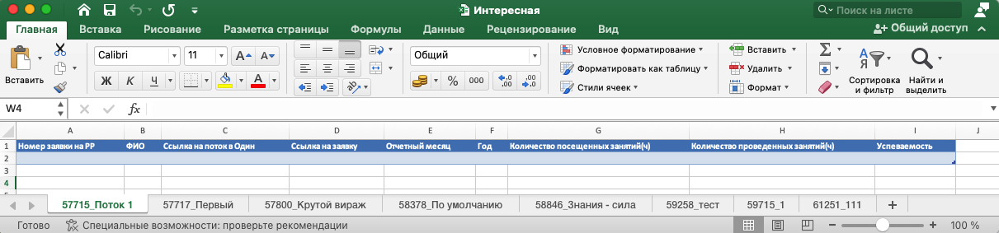

Для программ, участвующих в проекте АМСЗ, выгрузку в 1С можно сделать на странице программы в Odin.

.png>)

Она содержит следующие данные:

Даже если у пользователя не было за месяц нахождения в потоке ни одной активности. В колонках "Количество посещенных занятий (ч)" и "Количество проведенных занятий (ч)" будет значение 0.

В выгрузке на каждый поток формируется свой лист с названием потока.