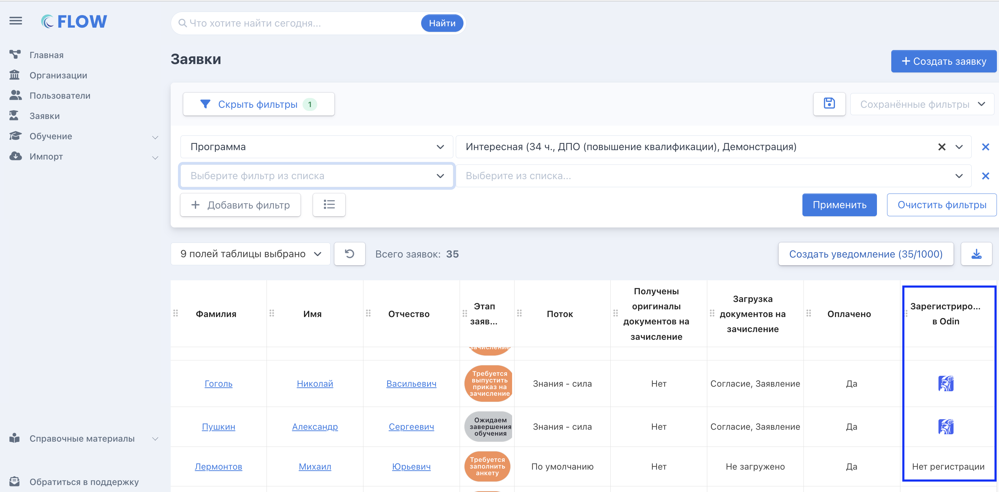

Во Flow настроена бесшовная интеграция с [LMS Odin](https://www.odin.study/connect), где можно организовать процесс обучения.

Для того чтобы связать организации в системах и настроить правильную передачу данных, между ними потребуется  сделать следующее:

### **ШАГ 1. Привязка организаций:**

1\.Зайти в существующую организацию в [системе Odin](https://www.odin.study/ru/University/Universities?page=1&name=&universityProjectTypes&universityLincenseTypes).

2\.Скопировать токен для интеграции с Flow.

.png>)

3\.Перейти в систему [Flow](https://www.flow-crm.study/).

4\.На странице организации во Flow на вкладке "Информация" необходимо включить "Да, зарегистрирована" и указать токен из пункта 2.

.png>)

### **ШАГ 2. Привязка подразделения:**

1\.Откройте организацию в системе [Odin](https://www.odin.study/ru/University/Universities?page=1&name=&universityProjectTypes&universityLincenseTypes).

2\.Создайте новое [подразделение](https://gramax.smile-tech.study/helpOdin/struktura/podrazdelenie). Если подразделение уже создано, его можно использовать во Flow.

:::danger 

**Важно!** Если организация является участником федеральных проектов, то для каждого из них необходимо создавать новое подразделение. Проверяющий с ролью АУДИТОР может быть назначен только на одно подразделение. Чтобы дать доступ на проверку только к определенным программам по одному из федеральных проектов, необходимо предоставить доступ к подразделению. Если в этом подразделении окажутся программы других федеральных проектов, это будет не очень хорошо.

:::

3\.Откройте организацию во Flow, перейдите на вкладку "Подразделения".

.png>)

4\.Создайте новое или перейдите к редактированию существующего подразделения.

.png>)

5\.Поставьте галочку "Да" и выберите подразделение, созданное в пункте 2, и сохраните.

.png>)

### **ШАГ 3. Привязка программ:**

#### **Способ 1: Создание новой программы в Odin из системы Flow.**

1. Создайте новую программу или откройте на редактирование существующую со страницы [Программы](https://www.flow-crm.study/EducationPrograms/EducationProgramList).

2. Выберите подразделение, привязанное к системе Odin в шаге 2.

3. Укажите "Использовать LMS Odin".

4. Выберите "Нет" в пункте "Программа уже создана в Odin".

5. Нажмите "Сохранить".

.png>)

Программа будет создана в LMS  Odin 🎉

#### **Способ 2: Связывание существующей программы из Flow с программой в LMS Odin**

:::danger 

***Важно!** После привязки данные в LMS Odin будут заменены данными из Flow*\
⚠ *Потоки, созданные до привязки программы, синхронизированы не будут и останутся только в Odin!*

:::

1. Создайте новую программу или откройте на редактирование существующую со страницы [Программы](https://www.flow-crm.study/EducationPrograms/EducationProgramList).

2. Выберите подразделение, привязанное к системе Odin в шаге 2.

3. Укажите "Использовать LMS Odin".

4. Выберите "Да" в пункте "Программа уже создана в Odin".

5. Выберите из списка необходимую программу из LMS Odin.

6. Нажмите "Сохранить".

.png>)

### **ШАГ 4. Привязка потока:**

Потоки создаются на странице программы, привязанной к LMS Odin, и  автоматически передаются в LMS Odin с данными из Flow.

.png>)

:::danger 

**Важно**\
Привязка потоков, созданных изначально в LMS Odin, к Flow **невозможна**! Все **потоки** необходимо создавать **только во Flow.**

:::

### **Про интеграцию профилей слушателей**

В столбце "Зарегистрирован в Odin" у заявок, НЕ записанных на поток в Odin, но имеющих профиль в Odin по ранее созданной (и уже неактивной) заявке Flow, будет отображаться статус "Нет регистрации".

В этом случае и в таблице заявок, и в самой заявке не будет отображаться иконка профиля в Odin, пока слушатель не попадет на поток в Odin.

**Как это применить:** при фильтрации заявок по ФИО будет видно две "одинаковые" заявки с одним набором данных. Одна заявка НЕ активная, так как прошла обучение и имеет профиль в Odin, что видно в таблице заявок.\
Вторая заявка активная, и ДО добавления в поток в Odin (то есть до выпуска приказа на зачисление или до того момента, пока не нажали на кнопку "Записать на обучение в Odin), в таблице заявок по ней будет статус "Нет регистрации".\
При таком сравнении будет понятно, что Активная заявка слушателя во Flow еще не записана на поток в Odin.

{width=174px height=213px}