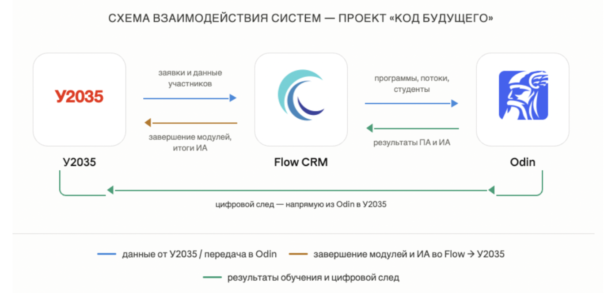

:::info 

**Flow CRM** -- система управления заявками и документооборотом провайдера (в терминологии Flow **провайдер = организация**). Именно здесь ведётся вся административная работа: приём данных от У2035, сбор персональных данных участников, зачисление, генерация договоров, согласий, заявлений,  приказов и сертификатов. Flow и Odin образуют **бесшовную среду**: данные о программах и потоках передаются из Flow в Odin автоматически, а результаты прохождения модулей возвращаются из Odin обратно во Flow.

(Провайдеры, которые не используют Flow, могут создавать программы и потоки напрямую в Odin -- это не ограничено.)  [Подробнее про Odin](https://docs.google.com/document/d/12AU2zdi5xxgAQX8yUf3da0wEBC2md3KTEQ2EaVM1gho/edit?tab=t.0#bookmark=id.woobgearuzn)

:::

## Как связаны системы

{width=1376px height=664px}

-  **У2035 -> Flow**: заявки, данные участников, статусы, баллы ВИ

-  **Flow -> Odin**: программы, потоки, списки студентов

-  **Odin -> Flow**: даты и результаты промежуточных аттестаций по каждому модулю, результат итоговой аттестации

-  **Flow -> У2035**: данные о завершении модулей, итоговые результаты

## 

## 