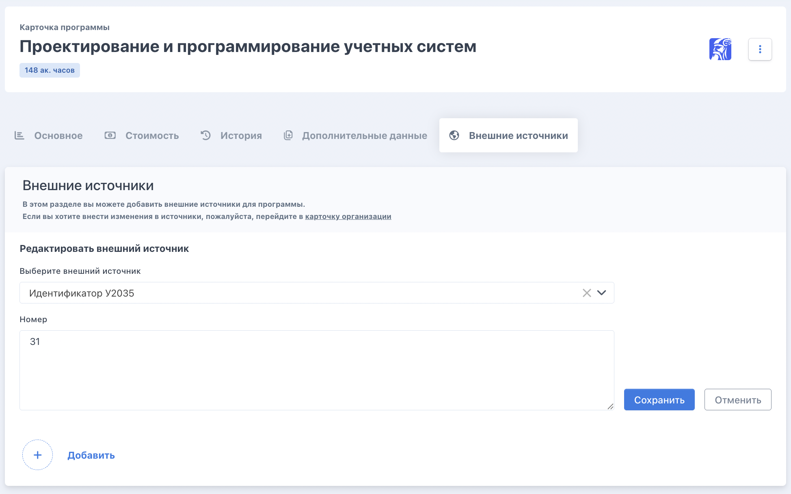
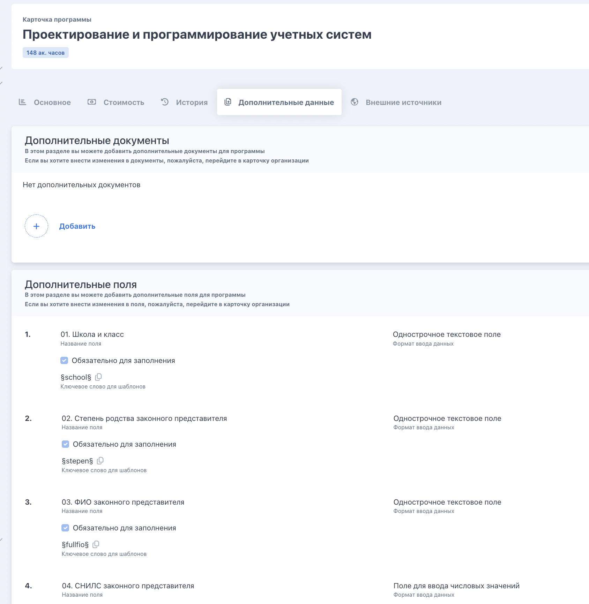
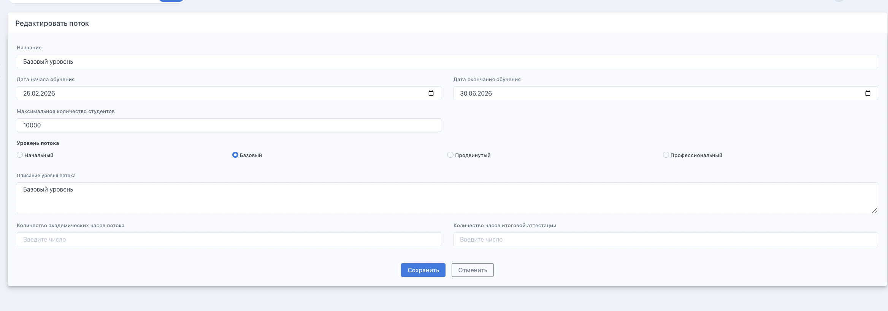
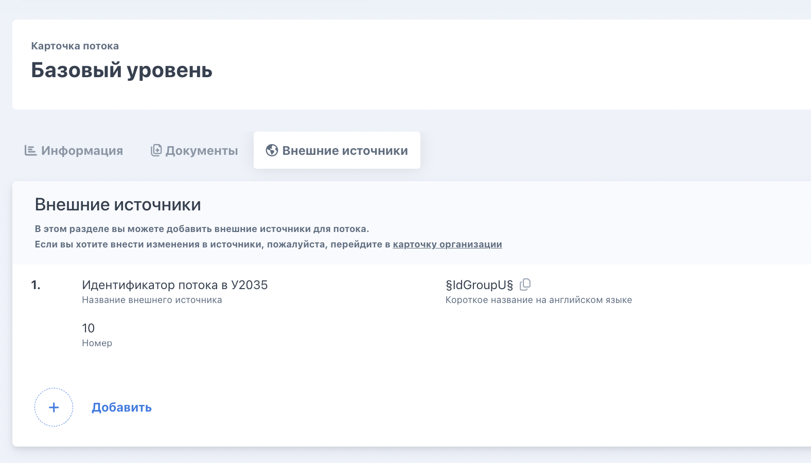

:::info 

Программы и потоки создаются **во Flow** и автоматически передаются в Odin. Создавать потоки напрямую в Odin и затем привязывать их к Flow **невозможно** -- всё создаётся только со стороны Flow.

:::

:::note 

Для того, чтобы в программе/потоке появилась возможность выбрать внешние источники и доп поля, их необходимо сначала [создать на странице организации](./trebuemye-dlya-kb-dop-polya-i-vneshnie-istochniki).

:::

## Программа

1. Указать **идентификатор курса с У2035** (внешний источник `§IdProgramU§`)

   {width=1948px height=1216px}

2. Сообщить в поддержку названия подходящих **групп шаблонов договора** (онлайн/офлайн × до 18 лет / 18+), эти группы шаблонов не будут отображаться в интерфейсе программы, они будут программно привязаны к ней и автоматически назначаться для заявки.

3. Подключить необходимые **дополнительные поля**  - настраиваются к карточке программы

{width=1688px height=1732px}

## Поток

1. Указать уровень потока (базовый/начальный/продвинутый/профессиональный) 

   {width=2336px height=820px}

2.  Заполнить **идентификатор потока с У2035** (внешний источник `§IdGroupU§`)

{width=1576px height=900px}