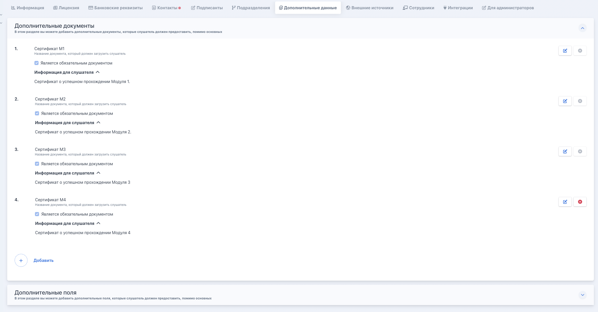

На странице организации необходимо создать  дополнительные поля и внешние источники.

:::info 

Дополнительные поля заполняются через личный кабинет, данные во внешних источниках заполняются  автоматически.

:::

## Дополнительные поля



---

*  

   №

*  

   Название поля

*  

   Тип поля

*  

   Обязательность

*  

   Ключ для шаблона

*  

   Примечание

---

*  

   01

*  

   Школа и класс

*  

   Однострочное текстовое поле

*  

   Да

*  

   §school§

*  

   

---

*  

   02

*  

   Степень родства законного представителя

*  

   Однострочное текстовое поле

*  

   Да

*  

   §stepen§

*  

   

---

*  

   03

*  

   ФИО законного представителя

*  

   Однострочное текстовое поле

*  

   Да

*  

   §fullfio§

*  

   

---

*  

   04

*  

   СНИЛС законного представителя

*  

   Числовое поле

*  

   Да

*  

   §snils§

*  

   

---

*  

   05

*  

   Дата рождения законного представителя

*  

   Выбор даты

*  

   Да

*  

   §dateBirth§

*  

   

---

*  

   06

*  

   Пол законного представителя

*  

   Однострочное текстовое поле

*  

   Да

*  

   §gender§

*  

   

---

*  

   07

*  

   Серия паспорта

*  

   Числовое поле

*  

   Да

*  

   §docseries§

*  

   

---

*  

   08

*  

   Номер паспорта

*  

   Числовое поле

*  

   Да

*  

   §docnumber§

*  

   

---

*  

   09

*  

   Дата выдачи паспорта

*  

   Выбор даты

*  

   Да

*  

   §issuedate§

*  

   

---

*  

   10

*  

   Кем выдан паспорт

*  

   Однострочное текстовое поле

*  

   Да

*  

   §issueorg§

*  

   

---

*  

   11

*  

   Код подразделения паспорта

*  

   Числовое поле

*  

   Да

*  

   §IssueIdPassportRF§

*  

   

---

*  

   12

*  

   Регион регистрации

*  

   Однострочное текстовое поле

*  

   Да

*  

   §Region§

*  

   как в паспорте

---

*  

   13

*  

   Населенный пункт регистрации

*  

   Однострочное текстовое поле

*  

   Да

*  

   §RegistrationLocality§

*  

   как в паспорте

---

*  

   14

*  

   Индекс регистрации

*  

   Числовое поле

*  

   Да

*  

   §RegistrationPostcode§

*  

   как в паспорте

---

*  

   15

*  

   Улица регистрации

*  

   Однострочное текстовое поле

*  

   Да

*  

   §RegistrationStreet§

*  

   как в паспорте

---

*  

   16

*  

   Дом регистрации

*  

   Однострочное текстовое поле

*  

   Да

*  

   §RegistrationHouse§

*  

   как в паспорте

---

*  

   17

*  

   Квартира регистрации

*  

   Однострочное текстовое поле

*  

   Да

*  

   §RegistrationAppartment§

*  

   как в паспорте

---

*  

   18

*  

   Регион фактического проживания

*  

   Однострочное текстовое поле

*  

   Да

*  

   §PostalRegion§

*  

   если совпадает -- дублируйте регион

---

*  

   19

*  

   Населенный пункт фактического проживания

*  

   Однострочное текстовое поле

*  

   Да

*  

   §PostalLocality§

*  

   если совпадает -- дублируйте

---

*  

   20

*  

   Индекс фактического проживания

*  

   Числовое поле

*  

   Да

*  

   §PostalPostcode§

*  

   если совпадает -- дублируйте

---

*  

   21

*  

   Улица фактического проживания

*  

   Однострочное текстовое поле

*  

   Да

*  

   §PostalStreet§

*  

   если совпадает -- дублируйте

---

*  

   22

*  

   Дом фактического проживания

*  

   Однострочное текстовое поле

*  

   Да

*  

   §PostalHouse§

*  

   если совпадает -- дублируйте

---

*  

   23

*  

   Квартира фактического проживания

*  

   Числовое поле

*  

   Да

*  

   §PostalAppartment§

*  

   если совпадает -- дублируйте

---

*  

   24

*  

   Фамилия (в дательном падеже)

*  

   Однострочное текстовое поле

*  

   Да

*  

   §LastNameDative§

*  

   

---

*  

   25

*  

   Имя (в дательном падеже)

*  

   Однострочное текстовое поле

*  

   Да

*  

   §FirstNameDative§

*  

   

---

*  

   26

*  

   Отчество (в дательном падеже)

*  

   Однострочное текстовое поле

*  

   Да

*  

   §MiddleNameDative§

*  

   

---

*  

   27

*  

   Телефон

*  

   Однострочное текстовое поле

*  

   Да

*  

   §Phone§

*  

   

---

*  

   28

*  

   Email

*  

   Однострочное текстовое поле

*  

   Да

*  

   §Email§

*  

   



## Внешние источники

| **Название внешнего источника**                                           | **Ключевое слово внешнего источника (название на английском)** | **Где отображается внешний источник** | **Откуда приходят/Куда отправляются данные**                                                                                                                                                                                          |
|---------------------------------------------------------------------------|----------------------------------------------------------------|---------------------------------------|---------------------------------------------------------------------------------------------------------------------------------------------------------------------------------------------------------------------------------------|
| Дата одобрения заявки У2035                                               | §DatapAproval§                                                 | заявка                                | Приходит с У2035 во Flow                                                                                                                                                                                                              |
| Результаты ВИ (Мотивация/Алгоритмика/Язык программирования/Общий балл)    | §EVI§                                                          | заявка                                | Приходит с У2035 во Flow                                                                                                                                                                                                              |
| Результаты ИТиСИ (Мотивация/Алгоритмика/Язык программирования/Общий балл) | §BallyITISI§                                                   | заявка                                | Приходит с У2035 во Flow                                                                                                                                                                                                              |
| Слушатель самостоятельно завершил ИТИСИ                                   | §FinishITISI§                                                  | заявка                                | Приходит с У2035 во Flow                                                                                                                                                                                                              |
| Статус прохождения ИТИСИ                                                  | §ITISI§                                                        | заявка                                | Приходит с У2035 во Flow                                                                                                                                                                                                              |
| Идентификатор потока в У2035                                              | §IdGroupU§                                                     | поток                                 | Приходит с У2035 во Flow                                                                                                                                                                                                              |
| Идентификатор У2035                                                       | §IdProgramU§                                                   | программа                             | Приходит с У2035 во Flow                                                                                                                                                                                                              |
| Номер заявки на У2035                                                     | §IdU§                                                          | заявка                                | Приходит с У2035 во Flow                                                                                                                                                                                                              |
| Текущий номер модуля в У2035                                              | §ModulU§                                                       | заявка                                | Приходит с У2035 во Flow                                                                                                                                                                                                              |
| Статус заявки на У2035                                                    | §StatusU§                                                      | заявка                                | Приходит с У2035 во Flow                                                                                                                                                                                                              |
| Статус трансферта                                                         | §Transfer§                                                     | заявка                                | Приходит с У2035 во Flow                                                                                                                                                                                                              |
| UntiId                                                                    | §UntiId§                                                       | заявка                                | Приходит с У2035 во Flow                                                                                                                                                                                                              |
| Дата автоотклонения на У2035                                              | §Untilldt§                                                     | заявка                                | Приходит с У2035 во Flow                                                                                                                                                                                                              |
| Дата сдачи ПА М1                                                          | §DatePAM§                                                      | заявка                                | Приходит из Odin во Flow                                                                                                                                                                                                              |
| Дата сдачи ПА М2                                                          | §DatePAMM§                                                     | заявка                                | Приходит из Odin во Flow                                                                                                                                                                                                              |
| Дата сдачи ПА М3                                                          | §DatePAMMM§                                                    | заявка                                | Приходит из Odin во Flow                                                                                                                                                                                                              |
| Дата сдачи ПА М4                                                          | §DatePAMMMM§                                                   | заявка                                | Приходит из Odin во Flow                                                                                                                                                                                                              |
| Дата прохождения ИА                                                       | §finalexamdate§                                                | заявка                                | Приходит из Odin во Flow                                                                                                                                                                                                              |
| Статус прохождения ИА                                                     | §finalexamstatus§                                              | заявка                                | Приходит из Odin во Flow                                                                                                                                                                                                              |
| Тип и Номер распорядительного акта ИА                                     | §finalexamordernumber§                                         | заявка                                | Распорядительный акт - это Ведомость. Назначение номера зашивается в код, высчитывается автоматически при получении данных по сдаче ИА из Odin через таблицу соответствий от организации. Значение проставляется во внешний источник. |
| Дата распорядительного акта ИА                                            | §finalexamorderdate§                                           | заявка                                | Распорядительный акт - это Ведомость. Дата зашивается в код, высчитывается автоматически при получении данных по сдаче ИА из Odin через таблицу соответствий от организации. Значение проставляется во внешний источник.              |
| Название итогового проекта                                                | §finalprojectname§                                             | заявка                                | Название итогового проекта также зашивается в код через таблицу соответствий от организации. Значение проставляется во внешний источник при получении данных по сдаче ИА из Odin                                                      |

## Дополнительные документы

Организации необходимо добавить следующие дополнительные документы. В эти дополнительные документы автоматически после генерации сохранятся сертификаты за каждый модуль. Это необходимо, чтобы слушатель мог видеть сертификаты в ЛК.

-  Сертификат М1 - Сертификат об успешном прохождении Модуля 1.

-  Сертификат М2 - Сертификат о успешном прохождении Модуля 2.

-  Сертификат М3 - Сертификат о успешном прохождении Модуля 3

-  Сертификат М4 - Сертификат о успешном прохождении Модуля 4

{width=2328px height=1214px}