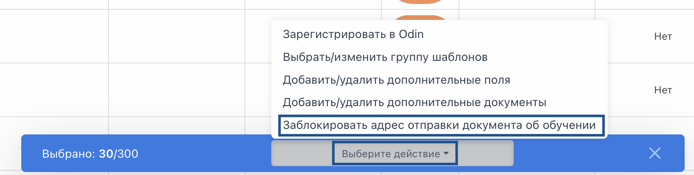
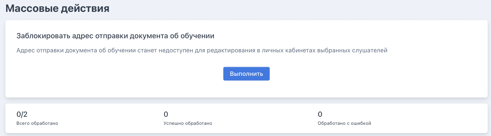
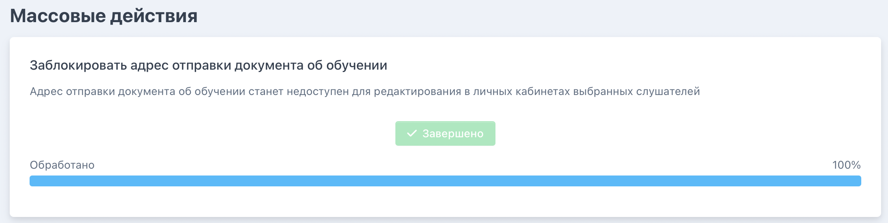

После успешного проведения массового действия у выбранных заявок будет заблокирована возможность менять в ЛК адрес отправки документа о квалификации. 

На странице заявок выберите заявки, по которым надо заблокировать замену адреса отправки документа о квалификации, далее нажмите «Выбрать действие» и выберите соответствующее.

{width=1632px height=414px}

Откроется страница с массовыми действиями, надо будет подтвердить действие по кнопке «Выполнить.

{width=2190px height=608px}

Когда действие выполнится, то кнопка изменится на «Завершено».

{width=2192px height=554px}

Обратите внимание на результат обработанных заявок, исправьте ошибки при необходимости и повторите массовое действие для этих заявок. 

{width=2176px height=436px}