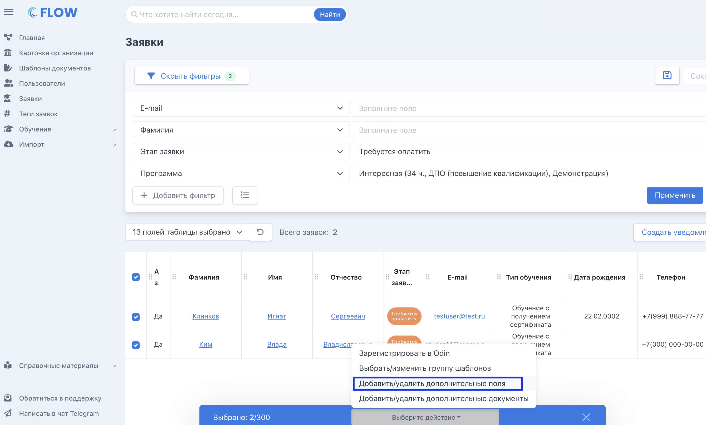
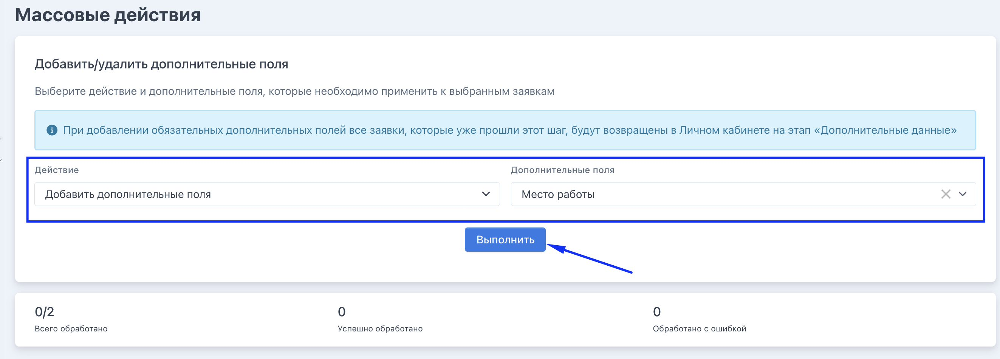
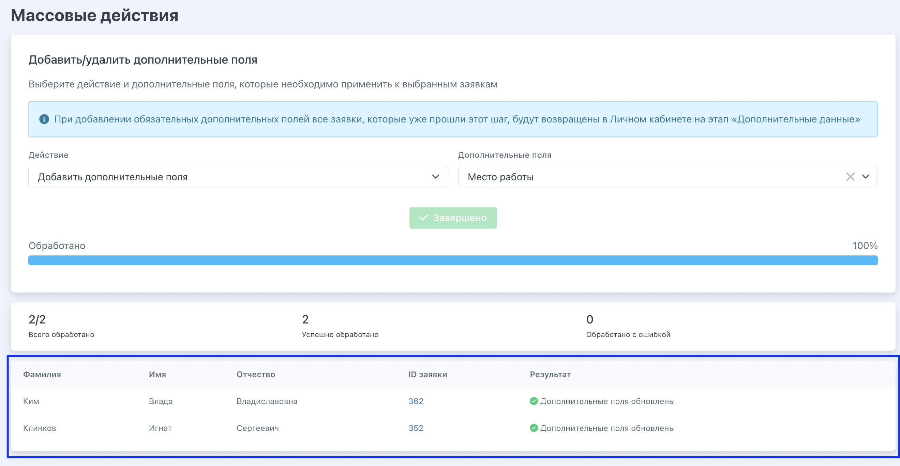

Шаг 1. Создайте дополнительные поля на странице организации во вкладке «Дополнительные данные»

:::note 

Важно помнить. Если доп.поля[ ранее добавлены в программу](./../Organization/dopolnitelnye-dokumenty-i-polya-vvoda-dannykh/_index), то все заявки программы, созданные после добавления в неё доп. полей, уже будут иметь эти доп. поля.

Повторное добавление не требуется.

:::

Шаг 2. В настраиваемом списке заявок выберите нужные заявки  -> появляется плашка с доступными действиями -> выберите нужное.

{width=2680px height=1616px}

Шаг 3. Выберите действие,  поле или поля и нажмите «Выполнить»

{width=2646px height=950px}

Шаг 4. Дождитесь завершения действия. При необходимости исправьте ошибки

{width=2640px height=1370px}