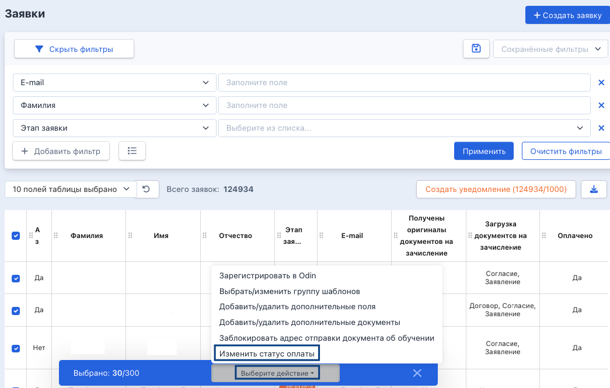
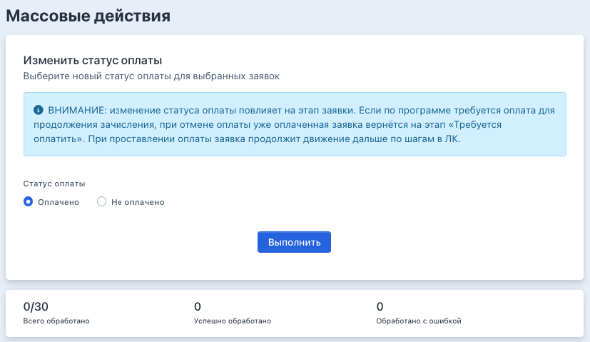

В системе доступно массовое действие «Изменить статус оплаты»: после успешного проведения массового действия у выбранных заявок изменится статус оплаты ровно так же, как если бы его меняли по одной заявке из карточки, с теми же ограничениями и с теми же последствиями для этапа заявки.

На странице со списком заявок, в выпадающем списке «Выберите действие» есть пункт «Изменить статус оплаты».

{width=1045px height=665px}

Далее в новой вкладке открывается страница выбранного массового действия с информацией, активной кнопкой «Выполнить» и счётчиком.

{width=827px height=479px}

Когда действие выполнится, то кнопка «Выполнить» изменится на «Завершено». Обратите внимание на результат обработанных заявок, исправьте ошибки при необходимости и повторите массовое действие для этих заявок.