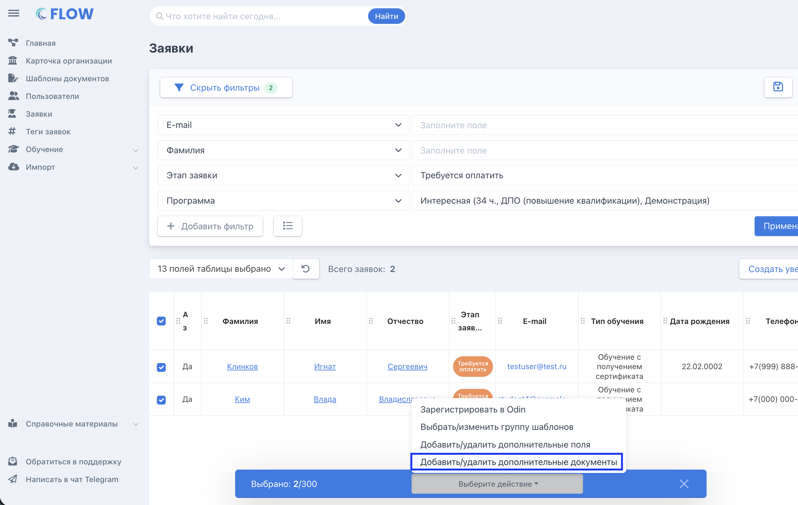
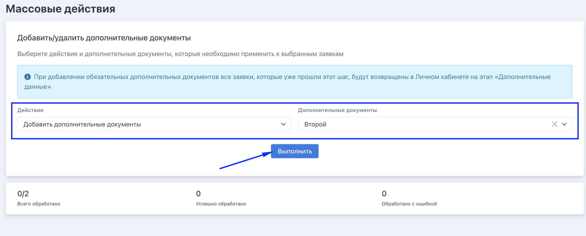
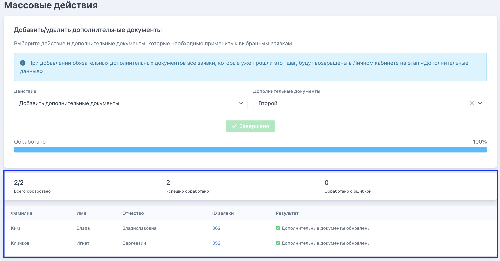

Шаг 1. Создайте дополнительные документы на странице организации во вкладке «Дополнительные данные»

:::note 

Важно помнить. Если доп.документы[ ранее добавлены в программу](./../Organization/dopolnitelnye-dokumenty-i-polya-vvoda-dannykh/_index#как-это-работает), то все заявки программы, созданные после добавления в неё доп. документов, уже будут иметь эти доп. документы. 

Повторное добавление не требуется.

:::

Шаг 2. В настраиваемом списке заявок выберите нужные заявки  -> появляется плашка с доступными действиями -> выберите нужное.

{width=2610px height=1654px}

Шаг 3. Выберите действие,  документ/документы и нажмите «Выполнить»

{width=2630px height=1058px}

Шаг 4. Дождитесь завершения действия. При необходимости исправьте ошибки

{width=2634px height=1378px}