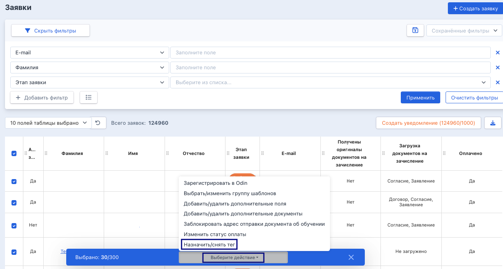
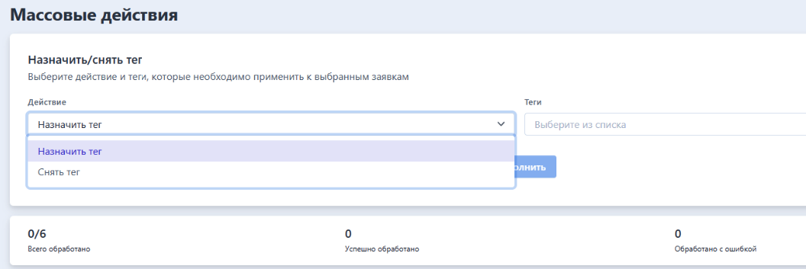

В системе доступно массовое действие «Назначить/изменить тег»: после успешного проведения массового действия у выбранных заявок будут проставлены (или сняты) выбранные теги, без изменения остальных тегов, которые уже были у заявки.

На странице со списком заявок, в выпадающем списке "Выберите действие" есть пункт "Назначить/снять тег».

{width=1314px height=703px}

После выбора действия в новой вкладке открывается страница массового действия с информацией, активной кнопкой «Выполнить» и счетчиком. В счетчике показывается, сколько заявок было выбрано для действия.

{width=1056px height=353px}

Далее необходимо выбрать назначить или снять тег, отметить тег, по которому начнется процесс. Нажать на кнопку «Выполнить».

### **После запуска процесса для каждой выбранной заявки:**

Если выбрано действие "Назначить тег" и у заявки такого тега еще нет -- тег добавится заявке, остальные теги заявки останутся без изменений.

Если выбрано действие "Назначить тег" и тег у заявки уже есть -- заявка сразу считается успешно обработанной.

Если выбрано действие "Снять тег" и тег у заявки есть -- тег у заявки убирается, остальные теги заявки останутся без изменений.

Если выбрано действие "Снять тег" и тега у заявки нет --  заявка сразу считается успешно обработанной.

Если выбрано несколько тегов сразу, правила применяются к каждому тегу по отдельности для каждой заявки.