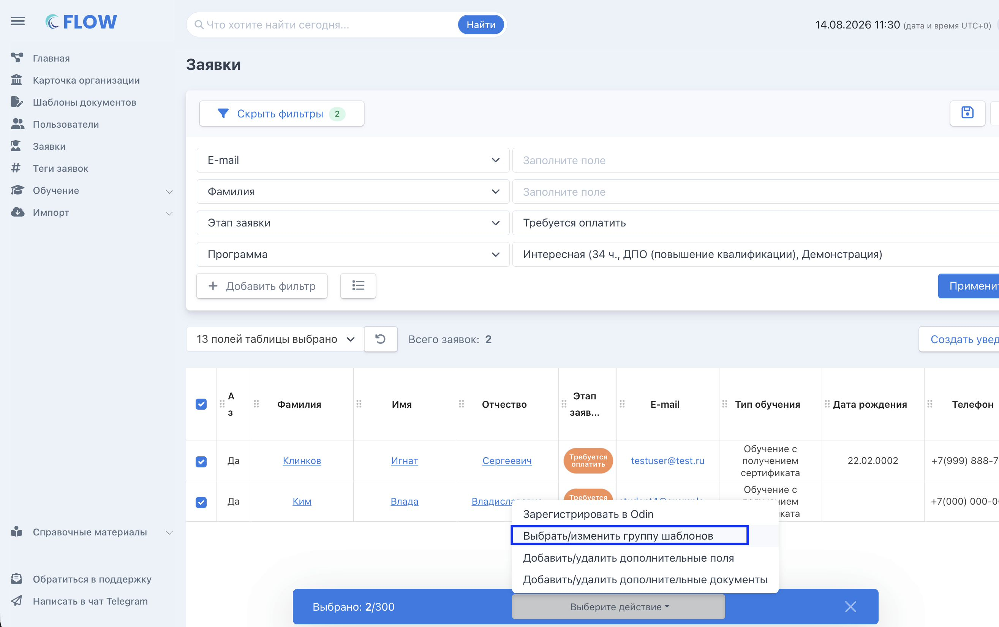
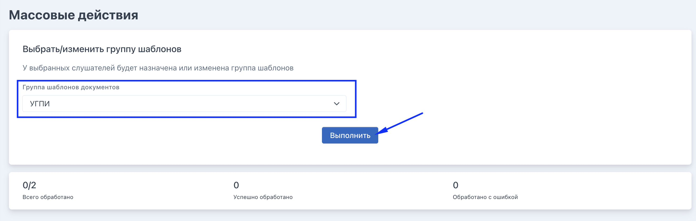
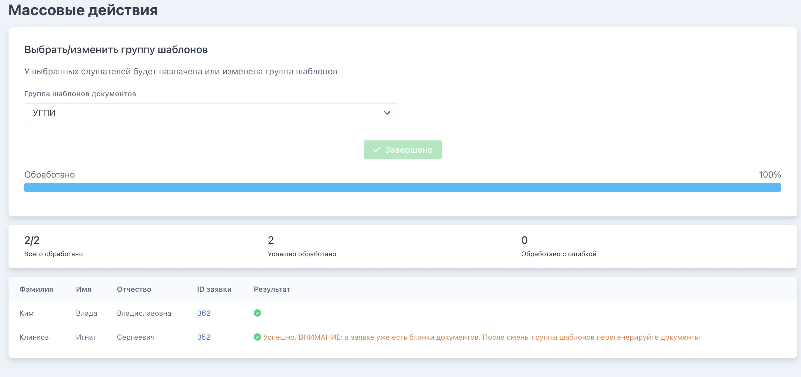

Шаг 1. Создайте [группу шаблонов](./../Organization/Shablony/_index) (можно использовать и ранее созданную)

:::note 

Важно помнить. Если группа шаблонов установлена в программе, то всех заявках программы, созданных после указания в ней  группы шаблонов, документы будут генерироваться на основании установленной группы.

Повторное указание группы шаблонов  не требуется.

:::

Шаг 2. В настраиваемом списке заявок выберите нужные заявки  -> появляется плашка с доступными действиями -> выберите нужное.

{width=2630px height=1650px}

Шаг 3. Выберите группу шаблонов и нажмите «Выполнить»

{width=2646px height=844px}

Шаг 4. Дождитесь завершения действия. При необходимости исправьте ошибки

{width=2636px height=1242px}