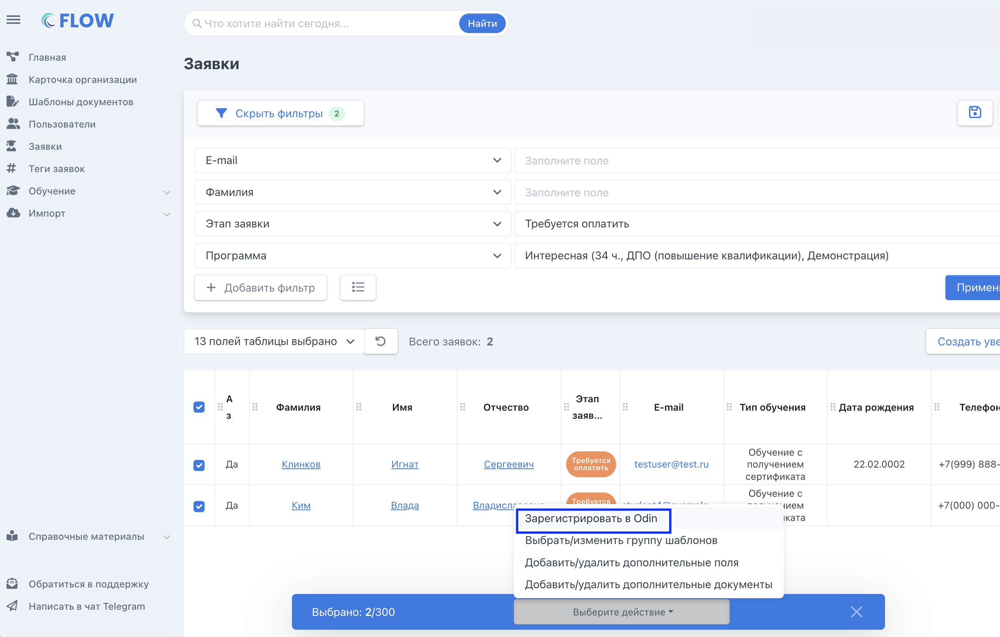
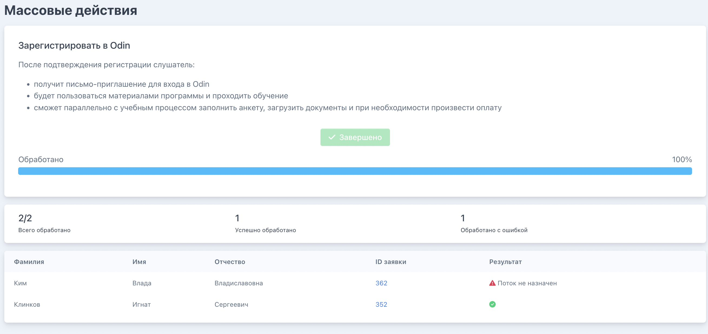

Шаг 1. В настраиваемом списке заявок выберите нужные заявки  -> появляется плашка с доступными действиями -> выберите нужное.

{width=2600px height=1658px}

Шаг 2. Нажмите «Выполнить»

{width=2076px height=824px}

Шаг 3. Дождитесь завершения действия. При необходимости исправьте ошибки

{width=2618px height=1236px}