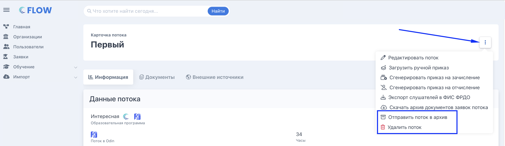
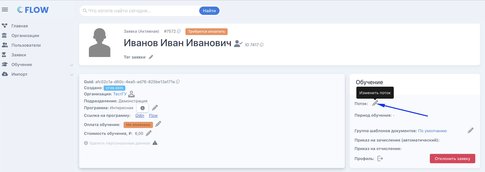
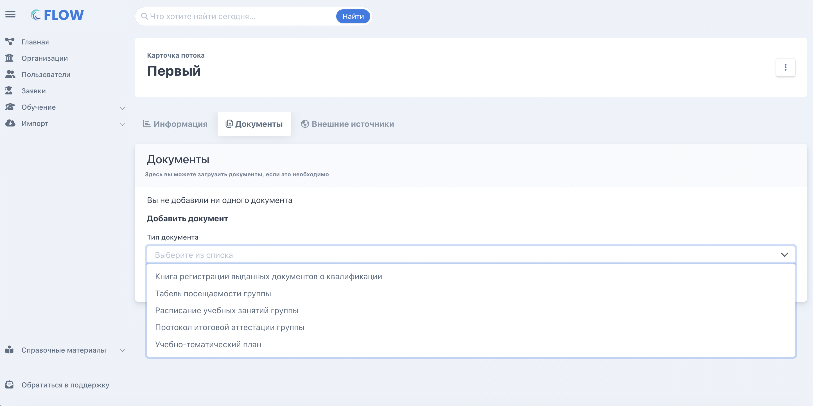

:::info 

Поток -- это конкретный период обучения по программе с фиксированными датами старта и окончания. Слушатель выбирает поток при подаче заявки. У каждого потока есть лимит слушателей.

:::

## Создание потока

Создать поток во Flow можно со страницы карточки программы в блоке "Основное" по кнопке "Создать поток".

.png>)

После создания потока будущий слушатель при записи на программу сможет выбрать этот поток при записи на обучение. Увидеть все потоки организации можно в меню "Обучение" - "Потоки".

.png>)

## Архивация/удаление потока

Поток можно отправить или в архив или удалить. Для этого на странице потока есть соответствующие кнопки.

{width=2908px height=846px}

:::info 

После архивации потока вместо кнопки "Отправить в архив" появляется кнопка "Восстановить из архива" и будет возможность восстановить поток.

:::

:::note 

При выборе потока на шаге в ЛК "Выбор периода" в выпадающем списке архивные потоки не отображаются.

У сотрудников организации нет возможности добавлять "добегающих" на обучение слушателей в архивные потоки, т.е. архивный поток не будет отображаться в списке активных потоков, на которые можно записать студентов.

:::

:::danger 

Нельзя архивировать/удалить поток, если:

-  в потоке есть активные заявки;

-  еще не наступила дата завершения обучения по потоку.

:::

## Добавление слушателей в поток

**Добавлять слушателей в поток можно даже после старта обучения -- через кнопку «Изменить» рядом с потоком в карточке заявки.**

**Исключения -- нельзя добавить в поток заявку если она:**

-  находится в процессе обучения (есть приказ на зачисление и нет приказа на отчисление);

-  завершила обучение в статусах «успешно», «неуспешно» или «отчислен по заявлению».

{width=2892px height=1032px}

Далее можно выбрать необходимый поток, а также отметить, требуется ли перегенерация ДЗС.

## Документы по потоку

**На вкладке «Документы» страницы потока можно загрузить документы группы:**

-  Книга регистрации выданных документов о квалификации

-  Табель посещаемости группы

-  Расписание учебных занятий группы

-  Протокол итоговой аттестации группы

-  Учебно-тематический план

{width=2892px height=1444px}