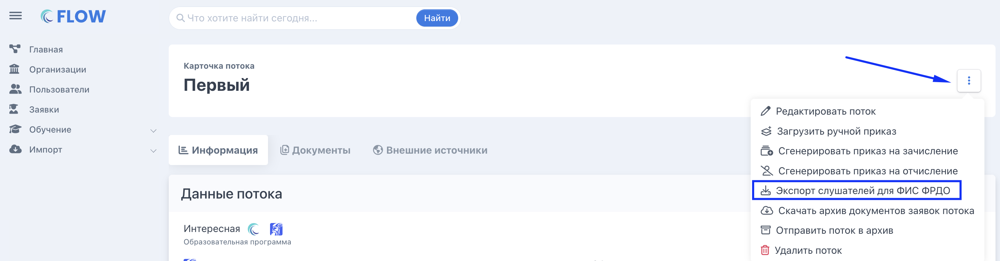

Есть государственная информационная система ФИС ФРДО, в которую образовательная организация отправляет полные данные о полученном человеком образовании

:::info 

**Только если образовательная организация заполнила информацию о лицензии во Flow, то тогда по ее потокам будет доступен экспорт слушателей в ФИС ФРДО.**

:::

Данные эта система принимает в формате Excel-файла. В системе Flow есть такой файл-шаблон. В шаблоне есть выпадающие списки с возможными вариантами значений для того, чтобы понимать как правильно автоматически заполнить документ, также при необходимости редактировать в нем данные.

На странице потока  есть кнопка “Экспорт слушателей для ФИС ФРДО”.

{width=2892px height=756px}

При нажатии на пункт меню “Экспорт слушателей для ФИС ФРДО” скачивается заполненный по шаблону файл с людьми по потоку. В файл включаются только те слушатели, у которых внесены данные документа о квалификации, выданного по окончании обучения.