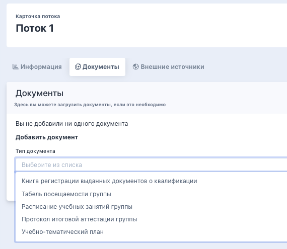

Поток - это период обучения по программе

## Создание потока

Создать поток во Flow можно со страницы карточки программы в блоке "Основное" по кнопке "Создать поток".

.png>)

После создания потока будущий слушатель при записи на программу сможет выбрать этот поток при записи на обучение. Увидеть все потоки организации можно в меню "Обучение" - "Потоки".

.png>)

## Архивация/удаление потока

Поток можно отправить или в архив или удалить. Для этого на странице потока есть соответствующие кнопки.

.png>)

При нажатии на кнопку "Отправить в архив" показывается предупреждение:

.png>)

После архивации потока вместо кнопки "Отправить в архив" появляется кнопка "Восстановить из архива" и будет возможность восстановить поток.

При нажатии на кнопку "Удалить" тоже показывается предупреждение, и после удаления поток перестанет отображаться в списке потоков во Flow и Odin (если есть синхронизация с Odin).

.png>)

При выборе потока на шаге в ЛК "Выбор периода" в выпадающем списке архивные потоки не отображаются.

У сотрудников организации нет возможности добавлять "добегающих" на обучение слушателей в архивные потоки, т.е. архивный поток не будет отображаться в списке активных потоков, на которые можно записать студентов.

Нельзя архивировать/удалить поток, если:

-  в потоке есть активные заявки;

-  еще не наступила дата завершения обучения по потоку.

:::info 

Если в потоке есть слушатели и по потоку проводилось обучение, его можно только перенести в архив. **Удалить поток можно только во Flow.**

:::

К названию потока во Flow добавится приставка “(в архиве)”, если он отправлен в архив.

В Odin (при наличии синхронизации с Odin) потоки, отправленные в архив через Flow, отображаются на странице программы в списке "архивные потоки". Если поток отправлен в архив в Odin, то он также архивируется во Flow. Если поток восстановлен из архива в Odin, то он также восстанавливается из архива в Flow.

## Добавление слушателей в поток

Можно добавлять слушателей даже после старта обучения. **Исключения:** заявка в процессе обучения (заявка считается в процессе обучения если ЕСТЬ приказ на зачисление и НЕТ приказа на отчисление); заявка завершила обучение в статусах **успешно/не успешно/отчислен** **на основании заявления слушателя.**

Сделать это можно по кнопке "Изменить" рядом с потоком.

.png>)

Далее можно выбрать необходимый поток, а также отметить, требуется ли перегенерация ДЗС.

.png>)

## Документы по потоку

На странице потока во вкладке «Документы» есть возможность добавить сканы документов. 

{width=570px height=495px}

**Типы документов для загрузки:**

-  Книга регистрации выданных документов о квалификации

-  Табель посещаемости группы

-  Расписание учебных занятий группы

-  Протокол итоговой аттестации группы

-  Учебно-тематический план

