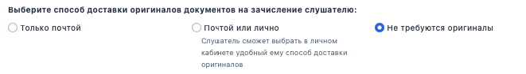

:::info 

При создании или редактировании программы можно сразу настроить её синхронизацию с LMS Odin. [Подробнее](./../../integracii/integraciya-s-lms-odin)

:::

## Добавление

.png>)

Укажите:

-  Название

-  [Тип программы](./tipy-programm-i-urovni-obrazovaniya)

-  Форму проведения программы:

   -  Очная

   -  Очно-заочная

   -  Заочная

   -  Не указано

-  Количество академических часов, на которое рассчитана программа

-  Минимальный уровень образования слушателей, которые допускаются для обучения

-  [Подразделение](./../../Organization/sozdanie-organizacii)

-  Контактный E-mail для публикации в Личном кабинете слушателя

-  Контактный телефон для публикации в Личном кабинете слушателя

-  Сайт с информацией об обучении для публикации в Личном кабинете слушателя

-  Определие способ доставки оригиналов документов на зачисление.

{width=661px height=94px}

---

Заполните по желанию необязательные поля и сохраните Программу.

.png>)

---

После создания программы будет предложено  "Перейти к добавлению [Стоимости](./stoimost-programmy)" или заполнить стоимость позже ->  откроется страница созданной программы, где следует добавить [Поток](./README/_index).

.png>)

## Редактирование

После создания программы, если потребуются определенные корректировки, необходимо открыть страницу программы, кликнув на название в списке программ и нажать на карандашик.

.png>)